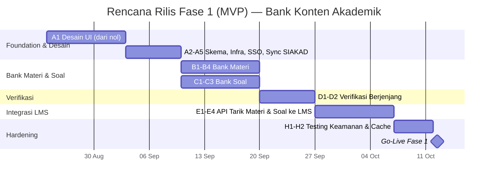

# Project Plan — Bank Konten Akademik UNSIA

## Bank Materi & Bank Soal

| Metadata | Keterangan |
|---|---|
| Terkait | BRD-Bank-Konten-Akademik.md, PRD-Bank-Konten-Akademik.md, ERD-Bank-Konten-Akademik.mermaid, Flow-Bisnis-Bank-Konten-Akademik.mermaid |
| Tech Stack | Next.js (App Router, fullstack), Drizzle ORM, PostgreSQL (database privat — microservices) |
| Status saat ini | ⚪ Belum ada implementasi — modul rekomendasi baru, belum ada mockup |
| Dependensi eksternal | **SIAKAD** (referensi MK), **SSO** (login & service auth), **LMS** (konsumen utama Fase 1) |
| Versi | 1.0 |
| Tanggal | 12 Juli 2026 |

---

## 1. Ringkasan Eksekutif

Berbeda dari modul-modul sebelumnya, Bank Konten **tidak punya mockup** — ini murni rekomendasi arsitektur untuk mengisi gap duplikasi soal/materi antar PMB, SIAKAD, dan LMS. Karena itu, prioritas Fase 1 adalah **membuktikan nilai lewat satu integrasi konsumen dulu (LMS)** sebelum memperluas ke SIAKAD & PMB — bukan membangun semua integrasi sekaligus.

---

## 2. Prasyarat & Blocking Items

| Item | Memblokir | Mitigasi |
|---|---|---|
| Belum ada mockup/desain UI sama sekali | Seluruh Epic B & C (perlu desain dulu) | Alokasikan waktu desain UI di Sprint 0, sama seperti gap Portal Dosen di SIAKAD |
| Keputusan: siapa Admin Bank Konten (Open Question BRD) | Epic D (verifikasi & tata kelola) | Klarifikasi ke pemilik produk — kemungkinan besar BPM yang sudah ada di LMS |
| LMS Fase 2 (verifikasi berjenjang materi) — lihat Plan-LMS-ICEMS.md Epic G1 — perlu selesai duluan atau berbarengan | Epic E (integrasi LMS) | Koordinasikan timeline dengan tim LMS; keduanya bisa saling melengkapi (LMS bisa langsung pakai verifikasi dari Bank Konten alih-alih bangun sendiri — evaluasi opsi ini) |
| Keputusan migrasi vs koeksistensi dgn `exam_questions`/`quiz_questions` existing | Epic F (integrasi SIAKAD/PMB) | Defaultnya **koeksistensi** (opsional), bukan migrasi paksa — sesuai BRD §4 |

---

## 3. Scope per Fase (rekap dari BRD)

| Fase | Cakupan |
|---|---|
| **Fase 1 (MVP)** | Bank Materi & Bank Soal dasar (CRUD, kategorisasi, verifikasi), integrasi API ke **LMS** saja |
| Fase 2 | Integrasi opsional ke SIAKAD (UTS/UAS) dan PMB (ujian seleksi) |
| Fase 3 | Generate otomatis (distribusi kesukaran), Analisis Butir Soal dari data hasil nyata |

---

## 4. Work Breakdown Structure

### Epic A — Foundation & Desain
| # | Task |
|---|---|
| A1 | Desain UI (belum ada mockup — perlu wireframe dari nol) |
| A2 | Desain & migrasi skema Drizzle (Fase 1: `material_bank_items`, `material_bank_versions`, `question_bank_items`, `question_bank_options`, `verification_records`) |
| A3 | Setup project, environment, CI/CD |
| A4 | Registrasi "Bank Konten" sbg `application` di SSO + role (`dosen`, `verifikator_prodi`, `verifikator_bpm`, `admin_bank_konten`) |
| A5 | Klien API ke SIAKAD (pull daftar MK utk kategorisasi) |

### Epic B — Bank Materi
| # | Task |
|---|---|
| B1 | Unggah materi + kategorisasi (MK/topik/tag) |
| B2 | Versioning (revisi membentuk versi baru, BR-03) |
| B3 | Pencarian & filter |
| B4 | Statistik pemakaian dasar |

### Epic C — Bank Soal
| # | Task |
|---|---|
| C1 | CRUD butir soal + opsi jawaban |
| C2 | Metadata kualitas (tingkat kesukaran manual, taksonomi Bloom, tag) |
| C3 | Aturan tidak-hapus utk soal terpakai (BR-02) + versioning (BR-03) |

### Epic D — Verifikasi Berjenjang (Shared)
| # | Task |
|---|---|
| D1 | Alur verifikasi Prodi → BPM (materi & soal, satu mesin status yang sama) |
| D2 | Notifikasi otomatis ke verifikator & kontributor |

### Epic E — Integrasi LMS (Fase 1, Konsumen Pertama)
| # | Task |
|---|---|
| E1 | API Tarik Materi — LMS bisa cari & tarik materi terverifikasi saat setup sesi |
| E2 | API Tarik Soal — LMS bisa generate set soal kuis dari Bank Soal |
| E3 | Event/API terima balik data agregat hasil kuis LMS (persiapan Fase 3 item analysis) |
| E4 | Usage logging (siapa/sistem apa menarik konten apa, kapan) |

### Epic F — Integrasi SIAKAD & PMB (Fase 2)
| # | Task |
|---|---|
| F1 | API Tarik Soal untuk UTS/UAS (SIAKAD) |
| F2 | API Tarik Soal untuk ujian seleksi (PMB) |
| F3 | Terima data agregat hasil dari kedua sistem tsb |

### Epic G — Generate Otomatis & Item Analysis (Fase 3)
| # | Task |
|---|---|
| G1 | Generate set soal dari kriteria distribusi kesukaran (FR-2.6) + exclude soal sering dipakai (BR-04) |
| G2 | Hitung ulang item analysis (tingkat kesukaran aktual, daya beda) tiap ada data baru |
| G3 | Flag otomatis soal kualitas buruk + notifikasi rekomendasi revisi ke kontributor |
| G4 | Dashboard adopsi lintas sistem (Admin Bank Konten) |

### Epic H — Testing & Hardening
| # | Task |
|---|---|
| H1 | Test keamanan — soal belum terbit/sedang dipakai ujian aktif tidak bisa diakses non-verifikator |
| H2 | Test cache di sisi konsumen — ujian tetap jalan walau Bank Konten down |
| H3 | Test akurasi kalkulasi item analysis |

---

## 5. Rencana Sprint (Fase 1 — asumsi 1 sprint = 2 minggu)

| Sprint | Minggu | Fokus |
|---|---|---|
| Sprint 0 | 1–2 | Desain UI dari nol (A1) — beda dari modul lain yang sudah punya mockup |
| Sprint 1 | 3 | Foundation teknis (A2–A5) |
| Sprint 2 | 4–5 | Bank Materi (B) & Bank Soal (C) berjalan paralel |
| Sprint 3 | 6 | Verifikasi Berjenjang (D) |
| Sprint 4 | 7–8 | Integrasi LMS (E) |
| Sprint 5 | 9 | Testing & Hardening (H1–H2) |
| Go-Live | 10 | Fase 1 live, LMS jadi konsumen pertama |

**Estimasi Fase 1: ± 10 minggu** — lebih lama dari modul lain relatif terhadap kompleksitasnya, karena harus mulai dari desain UI dari nol (tidak ada mockup existing).

---

## 6. Kebutuhan Tim

| Peran | Alokasi | Fokus |
|---|---|---|
| UI/UX Designer (1) | Full-time Sprint 0 | Desain wireframe — prioritas tertinggi di awal karena tidak ada mockup |
| Backend Engineer (2) | Full-time | Skema, verifikasi, API integrasi |
| Frontend Engineer (1) | Full-time setelah desain selesai | Implementasi UI |
| QA Engineer (1) | Paruh waktu, intensif Sprint 5 | Test keamanan & cache |
| Product/Tech Lead (1) | Paruh waktu | Koordinasi dgn tim LMS (Epic E) & keputusan tata kelola (§2) |

---

## 7. Risiko & Mitigasi

| Risiko | Dampak | Mitigasi |
|---|---|---|
| Tidak ada mockup → risiko desain UI berulang kali revisi, molor dari estimasi | Sedang-Tinggi | Sprint 0 dialokasikan khusus, jangan buru-buru masuk coding sebelum desain disetujui stakeholder |
| Dosen tidak mau pakai (resistensi, lihat BRD §8) | Tinggi — modul jadi sia-sia kalau adopsi rendah | Fase 1 fokus ke integrasi LMS dulu (adopsi lebih mudah didorong lewat 1 sistem, bukan langsung 3) sebelum ekspansi Fase 2 |
| Soal bocor karena API tarik soal tidak cukup aman | Tinggi | Prioritaskan H1 (test keamanan) sebelum go-live, bukan setelahnya |
| Timeline LMS Fase 2 (verifikasi materi) tidak sinkron dgn Epic D di sini — dua tim membangun hal serupa secara terpisah | Sedang | Koordinasi eksplisit dgn tim LMS di awal — pertimbangkan LMS **memakai** verifikasi dari Bank Konten alih-alih membangun sendiri, mengurangi duplikasi kerja |

---

## 8. Definition of Done — Fase 1 (MVP)

- [ ] Dosen dapat mengunggah materi/soal dan melihatnya melalui alur verifikasi Prodi → BPM sampai "Terbit".
- [ ] Dosen dapat mencari & memakai ulang materi/soal terverifikasi milik dosen lain.
- [ ] LMS berhasil menarik materi & soal dari Bank Konten saat setup sesi/kuis (integrasi API berfungsi end-to-end).
- [ ] Soal yang sudah dipakai ujian resmi tidak bisa dihapus, hanya diarsipkan.
- [ ] Usage log tercatat lengkap untuk setiap penarikan konten oleh LMS.
- [ ] Test keamanan lolos — konten belum terverifikasi tidak bisa diakses lewat API oleh pihak tidak berwenang.

---

## 9. Setelah Fase 1 (menuju Fase 2 & 3)

Evaluasi adopsi dari LMS dulu sebelum memutuskan prioritas ekspansi ke SIAKAD vs PMB (Epic F) — kalau LMS menunjukkan adopsi baik, lanjutkan pola yang sama; kalau resistensi tinggi, revisi UX/insentif dulu sebelum memperluas ke sistem konsumen lain.
