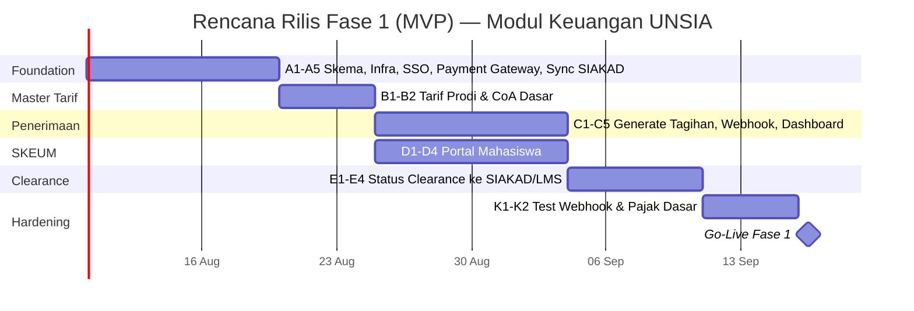

# Project Plan — Modul Keuangan UNSIA

## SKEU (Admin) & SKEUM (Portal Mahasiswa)

| Metadata | Keterangan |
|---|---|
| Terkait | BRD-Keuangan-UNSIA.md, PRD-Keuangan-UNSIA.md, ERD-Keuangan-UNSIA.mermaid, Flow-Bisnis-Keuangan-UNSIA.mermaid |
| Tech Stack | Next.js (App Router, fullstack), Drizzle ORM, PostgreSQL (database privat Keuangan — microservices) |
| Status saat ini | ⚪ Belum ada implementasi — baru BRD/PRD/ERD/Flow |
| Dependensi eksternal | **SIAKAD** (data mahasiswa, publish clearance), **SI-PMB** (funnel PMB), **SSO** (login), **HRIS** & **CRM** (read-only, mungkin belum tersedia sbg service) |
| Versi | 1.0 |
| Tanggal | 12 Juli 2026 |

---

## 1. Ringkasan Eksekutif

Modul Keuangan adalah modul **paling luas cakupannya** di antara seluruh sistem ERP UNSIA sejauh ini (Treasury, Penerimaan, Pengeluaran, Pajak, Akuntansi, Laporan). Rencana ini **mengikuti roadmap 4 fase dari BRD** — dimulai dari yang paling langsung berdampak ke mahasiswa (Penerimaan SPP/UKT + SKEUM), baru meluas ke area yang lebih back-office (Pengeluaran, Pajak, Akuntansi).

**Perbedaan penting**: modul ini punya **2 dependensi eksternal yang statusnya belum jelas** — HRIS dan CRM. Berbeda dari SIAKAD/PMB/LMS yang sama-sama sedang dibangun dalam ekosistem ini, HRIS & CRM disebut di mockup seolah **sudah ada** ("Sync dari HRIS", "Sync dari CRM") — perlu konfirmasi apakah keduanya benar-benar sistem yang sudah berjalan, atau turut perlu dibangun. Fase 3 (Pengeluaran) **diblokir** sampai ini jelas.

---

## 2. Prasyarat & Blocking Items

| Item | Memblokir | Mitigasi |
|---|---|---|
| Kejelasan status HRIS & CRM (sudah ada / perlu dibangun) | Epic F (Payroll), Epic G (Komisi CRM) — seluruh Fase 3 | Konfirmasi ke pemilik produk di awal; jika belum ada, Fase 3 direvisi jadi "bangun integrasi + service minimal" bukan sekadar "pull data" |
| Payment Gateway (Midtrans) — akun & kredensial produksi | Epic C (Penerimaan) | Pastikan tersedia sebelum Sprint 0, sama seperti kebutuhan gateway di PMB — idealnya **satu akun Midtrans yang sama** dipakai lintas modul (PMB, Keuangan) bila memungkinkan |
| Approval Yayasan utk perubahan tarif (BR-01) — perlu proses bisnis offline yang jelas | Epic B (Master Tarif) | Bukan blocker teknis, tapi perlu SOP approval didefinisikan sebelum fitur ini dipakai produksi |
| Definisi ambang "tertahan" (Open Question PRD §9) | Epic E (Clearance) | Perlu keputusan produk sebelum implementasi — default sementara: langsung `tertahan` begitu `due_date` terlewati |

---

## 3. Scope per Fase (rekap dari BRD, tidak berubah)

| Fase | Cakupan |
|---|---|
| **Fase 1 (MVP)** | Penerimaan Mahasiswa (SPP/UKT) + SKEUM + status clearance dasar ke SIAKAD |
| Fase 2 | Beasiswa & Keringanan, Penerimaan PMB (sinkron funnel), Wisuda & Kegiatan |
| Fase 3 | Pengeluaran (Payroll disbursement, PO, Honor Eksternal, Komisi CRM), Data Karyawan read-only |
| Fase 4 | Pajak & Kepatuhan penuh, Akuntansi (CoA, Jurnal, RAB), Laporan Keuangan lengkap |

---

## 4. Work Breakdown Structure

### Epic A — Foundation & Infrastructure
| # | Task |
|---|---|
| A1 | Desain & migrasi skema Drizzle (entitas Fase 1: `tuition_rates`, `student_invoices`, `student_invoice_items`, `payments`, `bank_accounts`, `bank_mutations`, `finance_clearance_status`) |
| A2 | Setup project Next.js, environment, CI/CD |
| A3 | Registrasi "Keuangan" sbg `application` di SSO + role (`kepala_biro`, `staf_penerimaan`, `staf_pengeluaran`, `staf_akuntansi`, `mahasiswa`) |
| A4 | Integrasi Payment Gateway (Midtrans) — webhook endpoint + validasi signature |
| A5 | Klien API ke SIAKAD (pull data mahasiswa aktif per prodi/periode) |

### Epic B — Master Tarif
| # | Task |
|---|---|
| B1 | CRUD `tuition_rates` per prodi/periode (dgn flag approval Yayasan) |
| B2 | Chart of Accounts dasar (CoA minimal utk Fase 1: akun kas, piutang, pendapatan SPP/BOP) |

### Epic C — Penerimaan Mahasiswa (Inti Fase 1)
| # | Task |
|---|---|
| C1 | Generate tagihan massal SPP/UKT per periode (pull data SIAKAD via A5) |
| C2 | Daftar tagihan + filter (prodi, status) |
| C3 | Webhook Payment Gateway — idempotency (pola sama Logic-Aplikasi-PMB.md §5) + auto-jurnal dasar |
| C4 | Tombol "Force Re-sync PG" |
| C5 | Dashboard ringkas: collection rate, outstanding, jatuh tempo |

### Epic D — Portal Keuangan Mahasiswa (SKEUM)
| # | Task |
|---|---|
| D1 | Beranda: tagihan aktif, jatuh tempo, status clearance |
| D2 | Detail tagihan + checkout pembayaran (VA/QRIS) |
| D3 | Riwayat transaksi + unduh e-kuitansi |
| D4 | Login via SSO, "Kembali ke SSO Induk" |

### Epic E — Status Clearance Finansial (Integrasi Kritis)
| # | Task |
|---|---|
| E1 | Job/trigger: deteksi tagihan lewat jatuh tempo → set `finance_clearance_status = tertahan` |
| E2 | Publish event `finance.clearance_changed` ke SIAKAD |
| E3 | Publish event yang sama ke LMS (walau LMS Fase 1 Track Kilat mungkin belum konsumsi ini — koordinasi timeline) |
| E4 | Reversal otomatis ke `aktif` begitu pembayaran melunasi tunggakan |

### Epic F — Pengeluaran: Payroll (Fase 3, setelah HRIS jelas)
| # | Task |
|---|---|
| F1 | Integrasi pull data payroll dari HRIS |
| F2 | Pipeline disbursement bertahap (Validasi → Pajak → Approval → Disburse) |
| F3 | Generate file transfer bank H2H |
| F4 | Auto-jurnal payroll |

### Epic G — Pengeluaran: PO & Honor (Fase 3)
| # | Task |
|---|---|
| G1 | CRUD PO + approval berjenjang otomatis (threshold BR-06) |
| G2 | Honor Eksternal + kalkulasi pajak otomatis + generate bukti potong |
| G3 | Integrasi antrean komisi CRM + disbursement + sync status "Paid" balik ke CRM |

### Epic H — Pajak & Kepatuhan (Fase 4)
| # | Task |
|---|---|
| H1 | Kalkulasi & tracking kewajiban pajak (PPh21/23/4(2)) |
| H2 | Generate e-Bupot, ID Billing, SPT Masa (format DJP-online) |
| H3 | Iuran BPJS + generate file SIPP |

### Epic I — Akuntansi & Laporan (Fase 4)
| # | Task |
|---|---|
| I1 | Jurnal Umum lengkap (auto-post semua sub-modul + manual) |
| I2 | RAB/Anggaran per unit + tracking realisasi |
| I3 | Laporan Neraca, L/R, Arus Kas (format PSAK 45) |
| I4 | Aging Piutang, Laporan ke Yayasan, Report Builder kustom |

### Epic J — Beasiswa, PMB Sync, Wisuda (Fase 2)
| # | Task |
|---|---|
| J1 | CRUD program beasiswa + pembebanan otomatis ke tagihan |
| J2 | Pengajuan & approval keringanan/cicilan (SKEUM + Admin) |
| J3 | Sinkron funnel PMB (pull dari SI-PMB) |
| J4 | Modul Wisuda & Kegiatan Berbayar (cost-center per event) |

### Epic K — Testing & Hardening
| # | Task |
|---|---|
| K1 | Test idempotency webhook Payment Gateway |
| K2 | Test akurasi kalkulasi pajak (kasus tepi tiap bracket) |
| K3 | Test integritas event clearance ke SIAKAD & LMS (tidak ada status nyasar) |
| K4 | Security test data finansial & NIK/NPWP |

---

## 5. Rencana Fase 1 (MVP) — Sprint Plan

| Sprint | Minggu | Fokus |
|---|---|---|
| Sprint 0 | 1–2 | Foundation (A1–A5) |
| Sprint 1 | 3 | Master Tarif (B1–B2) |
| Sprint 2 | 4–5 | Penerimaan (C1–C5) + SKEUM (D1–D4) berjalan paralel |
| Sprint 3 | 6 | Status Clearance (E1–E4) — titik integrasi paling kritis |
| Sprint 4 | 7 | Testing & Hardening (K1–K2) |
| Go-Live | 8 | Fase 1 MVP live |

**Estimasi Fase 1 (MVP): ± 8 minggu**, dengan syarat SIAKAD & SSO Fase 1 sudah live sebelum Sprint 0.

**Fase 2–4** mengikuti kecepatan normal (sprint 2 minggu) setelah Fase 1 stabil, dgn Fase 3 tertunda sampai status HRIS/CRM jelas (lihat §2).

---

## 6. Kebutuhan Tim

| Peran | Alokasi | Fokus |
|---|---|---|
| Backend Engineer (2–3) | Full-time | Integrasi Payment Gateway, kalkulasi tarif/pajak, event clearance |
| Frontend Engineer (1–2) | Full-time | SKEU dashboard, SKEUM |
| Akuntan/Business Analyst Keuangan (1) | Konsultatif, intensif Fase 4 | Validasi logika akuntansi, format laporan PSAK 45, aturan pajak |
| QA Engineer (1) | Paruh waktu, intensif tiap akhir fase | Test akurasi kalkulasi & idempotency |
| Product/Tech Lead (1) | Paruh waktu | Koordinasi HRIS/CRM, keputusan bisnis (§2), approval SOP tarif |

> Modul ini adalah satu-satunya yang butuh **Akuntan/Business Analyst Keuangan** khusus — kesalahan logika pajak/akuntansi punya konsekuensi legal, bukan sekadar bug biasa.

---

## 7. Risiko & Mitigasi

| Risiko | Dampak | Mitigasi |
|---|---|---|
| Event clearance gagal terkirim → mahasiswa lunas tapi tetap terblokir ujian | Sangat Tinggi — dampak langsung ke pengalaman akademik | Idempotent + retry + tombol "Force Re-sync" + monitoring alert khusus utk kegagalan event ini |
| Kesalahan kalkulasi pajak progresif | Tinggi — konsekuensi legal & finansial | Validasi berlapis, ada Akuntan/BA yang cross-check formula sebelum go-live Fase 4 |
| HRIS/CRM ternyata belum ada sbg service nyata | Tinggi — Fase 3 tidak bisa mulai sesuai rencana | Klarifikasi di awal proyek (§2), siapkan rencana B: bangun modul HRIS/CRM minimal jika perlu |
| Data finansial mahasiswa (NIK/NPWP) bocor | Tinggi | Enkripsi at-rest, akses granular per sub-modul, audit log ketat |
| Approval PO/Yayasan berjalan lambat secara proses bisnis (bukan teknis) → menghambat operasional | Sedang | Bukan masalah sistem, tapi sistem harus beri visibilitas jelas status approval agar tidak "hilang" di tengah proses |

---

## 8. Definition of Done — Fase 1 (MVP)

- [ ] Tagihan SPP/UKT ter-generate otomatis untuk seluruh mahasiswa aktif tiap awal periode.
- [ ] Mahasiswa dapat melihat tagihan, membayar via Payment Gateway, dan melihat riwayat transaksi di SKEUM.
- [ ] Pembayaran via VA/QRIS terekonsiliasi & terjurnal otomatis tanpa intervensi manual.
- [ ] Status clearance finansial berubah otomatis (`aktif` ↔ `tertahan`) sesuai status tagihan, dan **tersinkron ke SIAKAD**.
- [ ] Tidak ada kasus mahasiswa lunas yang masih berstatus tertahan (atau sebaliknya) setelah pengujian idempotency.
- [ ] Dashboard dasar (collection rate, outstanding) tersedia untuk Kepala Biro Keuangan.

---

## 9. Setelah Fase 1 (menuju Fase 2)

Prioritaskan **Beasiswa & Keringanan (Epic J1–J2)** lebih dulu dari Wisuda/PMB sync, karena berdampak langsung pada mahasiswa yang sudah aktif transaksi di SKEUM sejak Fase 1 — mengurangi risiko keluhan mahasiswa yang perlu keringanan tapi fiturnya belum ada.
