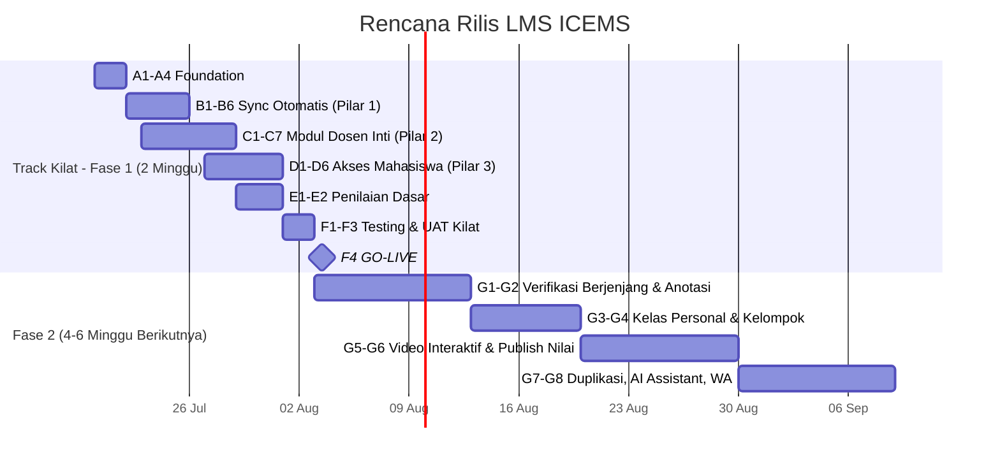

# Project Plan — LMS ICEMS

## Learning Management System UNSIA

| Metadata | Keterangan |
|---|---|
| Terkait | BRD-LMS-ICEMS.md, PRD-LMS-ICEMS.md, ERD-LMS-ICEMS.mermaid, Flow-Bisnis-LMS-ICEMS.mermaid, Logic-Aplikasi-LMS.md |
| Tech Stack | Next.js (App Router, fullstack), Drizzle ORM, PostgreSQL (database privat LMS — microservices) |
| Status saat ini | ⚪ Belum ada implementasi — baru BRD/PRD/ERD/Flow/Logic |
| Dependensi eksternal | **SIAKAD** (sumber data akademik, read-only), **SSO Platform** (login) |
| Target bisnis asli | Go-live dalam **2 minggu** (per `target_LMS_2_minggu.html`) — lihat catatan realitas di §2 |
| Versi | 1.0 |
| Tanggal | 12 Juli 2026 |

---

## 1. Ringkasan Eksekutif

BRD menetapkan target agresif: go-live dalam 2 minggu dengan 3 pilar (Sync Otomatis → Aktivasi Dosen → Aktivasi Mahasiswa). Rencana ini **membagi scope PRD menjadi 2 track**:

- **Track Kilat (Fase 1 — 2 minggu)**: versi minimum yang cukup untuk dosen & mahasiswa mulai memakai LMS aktif — sync data, materi/tugas/kuis/video/live conference dasar, akses penuh mahasiswa. **Verifikasi berjenjang, anotasi PDF, Kelas Personal, Kelompok, Video Interaktif dgn marker, dan AI Assistant SENGAJA ditunda ke Fase 2** — fitur-fitur itu tidak disebut sbg kriteria go-live di BRD §7 (Metrik Sukses), jadi bukan blocker peluncuran awal.
- **Fase 2 (setelahnya)**: fitur kualitas & tata kelola yang melengkapi, sesuai PRD lengkap.

> ⚠️ **Catatan realitas**: 2 minggu untuk *sync + aktivasi dasar* itu sendiri sudah sangat ketat — realistis hanya tercapai jika (1) SIAKAD API/data sudah tersedia & stabil, (2) tim fokus penuh tanpa gangguan modul lain, (3) scope benar-benar dipangkas ke yang esensial saja seperti dirinci di §4. Jika salah satu syarat tidak terpenuhi, sebaiknya negosiasikan ulang timeline atau kurangi lebih jauh (mis. Live Conference pakai Jitsi Internal saja dulu, provider lain menyusul).

---

## 2. Prasyarat & Blocking Items

| Item | Memblokir | Mitigasi |
|---|---|---|
| SIAKAD API belum tersedia/stabil (endpoint periode/kelas/KRS) | Epic B (Sync) — inti dari Pilar 1 | Koordinasi mendesak dgn tim SIAKAD; jika API belum siap, mulai dgn **data seed manual sementara** agar tim LMS tidak menunggu total |
| SSO Fase 1 belum live | Login dosen/mahasiswa | Sama seperti PMB/SIAKAD — pastikan SSO minimal OAuth2 core sudah jalan |
| Provider vicon (Zoom/Meet API key) belum ada | Epic C5 | Prioritaskan **Jitsi Internal** dulu sbg default (tidak butuh API key eksternal), Zoom/Meet menyusul |
| Kebijakan *source of truth* nilai (LMS vs SIAKAD) belum diputuskan (Open Question PRD) | Epic E3 (publish nilai) | Untuk Track Kilat, nilai LMS **tidak perlu** publish ke SIAKAD dulu — cukup tersimpan lokal, keputusan integrasi menyusul Fase 2 |

---

## 3. Scope per Track

| Track | Cakupan | Target Waktu |
|---|---|---|
| **Track Kilat (Fase 1)** | Sync SIAKAD, kelas akademik otomatis, materi/tugas/kuis/video/live conference **dasar** (tanpa verifikasi berjenjang, tanpa anotasi), akses mahasiswa penuh, penilaian dasar (tanpa publish ke SIAKAD) | 2 minggu (agresif) |
| **Fase 2** | Verifikasi berjenjang Prodi/BPM, Kelas Personal, Kelompok, anotasi PDF, Video Interaktif dgn marker, publish nilai ke SIAKAD | ± 4–6 minggu setelahnya |
| **Fase 3** | AI Assistant, notifikasi WhatsApp penuh, analytics pembelajaran, provider vicon tambahan | Menyusul |

---

## 4. Work Breakdown Structure

### Epic A — Foundation (Hari 1–2)
| # | Task |
|---|---|
| A1 | Setup project Next.js + skema Drizzle (entitas Track Kilat saja dulu — `lms_classes`, `class_enrollments`, `sessions`, `materials`, `assignments`, `assignment_submissions`, `quizzes`, `quiz_attempts`, `video_conferences`, `vc_attendances`, `grades`) |
| A2 | Setup environment + CI/CD |
| A3 | Registrasi "LMS" sbg `application` di SSO + role (`dosen`, `mahasiswa`) |
| A4 | Klien API ke SIAKAD (autentikasi service-to-service via OAuth2 client credentials) |

### Epic B — Sync Otomatis (Pilar 1, Hari 2–5)
| # | Task |
|---|---|
| B1 | Job sync periode akademik & MK aktif |
| B2 | Job sync dosen pengampu & jadwal |
| B3 | Job sync peserta dari KRS disetujui |
| B4 | Dashboard Dosen — kelas otomatis muncul |
| B5 | Dashboard Mahasiswa — kelas otomatis muncul dari KRS |
| B6 | Status sinkronisasi terakhir ditampilkan di Info Kelas |

### Epic C — Modul Dosen Inti (Pilar 2, Hari 4–9, paralel dgn Epic B lanjutan)
| # | Task |
|---|---|
| C1 | Manajemen Sesi (daftar 16 pertemuan, tambah/edit) |
| C2 | Upload Materi (dokumen/video) — **langsung terbit tanpa verifikasi** di Track Kilat |
| C3 | Buat & kelola Tugas |
| C4 | Buat & kelola Kuis (timer, auto-submit — pola sama dgn CBT PMB) |
| C5 | Jadwalkan Live Conference — **Jitsi Internal dulu**, tautan otomatis dibagikan |
| C6 | Upload Video Pembelajaran (video biasa, belum interaktif) |
| C7 | Publikasi Cepat dari linimasa (shortcut ke C2–C5) |

### Epic D — Akses Mahasiswa Penuh (Pilar 3, Hari 8–12)
| # | Task |
|---|---|
| D1 | Akses semua kelas dari KRS |
| D2 | Lihat/unduh materi, kerjakan & submit tugas (auto-save draft) |
| D3 | Ikuti kuis dalam periode |
| D4 | Join live conference — **presensi otomatis** saat join |
| D5 | Putar ulang rekaman |
| D6 | Linimasa diskusi dasar (post + komentar, tanpa mention/like dulu jika waktu mepet) |

### Epic E — Penilaian Dasar
| # | Task |
|---|---|
| E1 | Daftar submission per tugas + input nilai & feedback (tanpa anotasi PDF) |
| E2 | Rekap nilai per kelas (Kehadiran/Tugas/UTS/UAS/Akhir/Huruf) — dihitung lokal |

### Epic F — Testing & Go-Live (Hari 12–14)
| # | Task |
|---|---|
| F1 | Test sync end-to-end dgn data SIAKAD nyata (bukan mock) |
| F2 | Test live conference + presensi otomatis pada beban nyata (banyak peserta join bersamaan) |
| F3 | UAT kilat bersama beberapa dosen & mahasiswa pilot |
| F4 | Go-live |

### Epic G — Fase 2 (setelah Track Kilat stabil)
| # | Task |
|---|---|
| G1 | Verifikasi berjenjang Prodi → BPM (status materi, notifikasi verifikator) |
| G2 | Anotasi langsung pada berkas jawaban (PDF) |
| G3 | Kelas Personal (non-akademik, kontrol akses) |
| G4 | Kelompok Diskusi/Tugas (otomatis acak/IPK/angkatan, manual) |
| G5 | Video Interaktif dgn penanda pertanyaan |
| G6 | Publish nilai final ke SIAKAD (event `grade.finalized`) |
| G7 | Duplikasi bahan ajar dari periode lalu |
| G8 | AI Assistant, notifikasi WhatsApp penuh |

---

## 5. Rencana Waktu

| Periode | Fokus |
|---|---|
| Hari 1–2 | Foundation |
| Hari 2–8 | Sync (B) + mulai Modul Dosen (C), berjalan paralel begitu skema dasar siap |
| Hari 8–12 | Akses Mahasiswa (D) + Penilaian Dasar (E) |
| Hari 12–14 | Testing kilat + UAT + **Go-Live Track Kilat** |
| Minggu 3–8 | Fase 2 — fitur kualitas & tata kelola (G1–G8), kecepatan normal (sprint 2 minggu) |

---

## 6. Kebutuhan Tim (Track Kilat — intensif)

| Peran | Alokasi | Fokus |
|---|---|---|
| Backend Engineer (2–3) | Full-time, termasuk lembur di minggu kritis | Sync SIAKAD, modul sesi/tugas/kuis, live conference |
| Frontend Engineer (2) | Full-time | Dashboard Dosen & Mahasiswa, halaman sesi |
| QA Engineer (1) | Full-time di minggu kedua | Test sync & live conference dgn beban nyata |
| Product/Tech Lead (1) | Full-time | Jaga scope ketat, tolak permintaan fitur di luar Track Kilat, koordinasi SIAKAD |

> Track Kilat butuh alokasi tim **lebih padat** dari plan SSO/PMB/SIAKAD sebelumnya karena timeline yang jauh lebih pendek relatif terhadap scope-nya.

---

## 7. Risiko & Mitigasi

| Risiko | Dampak | Mitigasi |
|---|---|---|
| SIAKAD API belum siap di hari pertama | Sangat Tinggi — seluruh Epic B tertunda | Eskalasi prioritas lintas tim sebelum Sprint dimulai; siapkan data seed manual sbg fallback sementara |
| Scope merembet ke fitur Fase 2 di tengah Track Kilat | Tinggi — timeline 2 minggu meleset | Tech Lead punya wewenang tegas menolak/menunda permintaan di luar §4 Track Kilat |
| Live conference gagal di beban nyata (banyak mahasiswa join bersamaan) | Tinggi — merusak pengalaman go-live | Load test khusus (F2) sebelum go-live, mulai dgn Jitsi Internal yang bisa dikontrol kapasitasnya |
| Materi tayang tanpa verifikasi (Track Kilat skip BR-02) berisiko konten belum layak | Sedang | Komunikasikan eksplisit ke dosen bahwa Track Kilat **sementara** tanpa gate mutu — Fase 2 menutup celah ini secepatnya |
| Tim kelelahan akibat timeline agresif | Sedang | Pantau beban kerja, siap negosiasikan mundur beberapa hari kalau kualitas jadi taruhannya |

---

## 8. Definition of Done — Track Kilat (Fase 1)

Sesuai Kriteria Keberhasilan BRD §7:
- [ ] Semua mahasiswa dapat akses penuh ke seluruh kelas mereka di LMS (dari KRS).
- [ ] Semua dosen memiliki kelas (otomatis dari plotting) dan bisa unggah materi perkuliahan.
- [ ] Seluruh mata kuliah aktif tampil otomatis dan terhubung data akademik (sync berjalan, status sinkronisasi terlihat).
- [ ] Dosen bisa membuat tugas, kuis, dan live conference; mahasiswa bisa mengerjakan/mengikutinya.
- [ ] Presensi live conference tercatat otomatis.
- [ ] Rekap nilai dasar tersedia per kelas (walau belum ter-publish ke SIAKAD).

---

## 9. Setelah Track Kilat (menuju Fase 2)

Prioritas Fase 2 sesuai §4 Epic G — **dahulukan G1 (Verifikasi Berjenjang)** karena ini menutup gap mutu yang sengaja dilewati saat Track Kilat, dan **G6 (Publish Nilai ke SIAKAD)** begitu keputusan *source of truth* nilai (Open Question PRD) sudah diputuskan pemilik produk.
