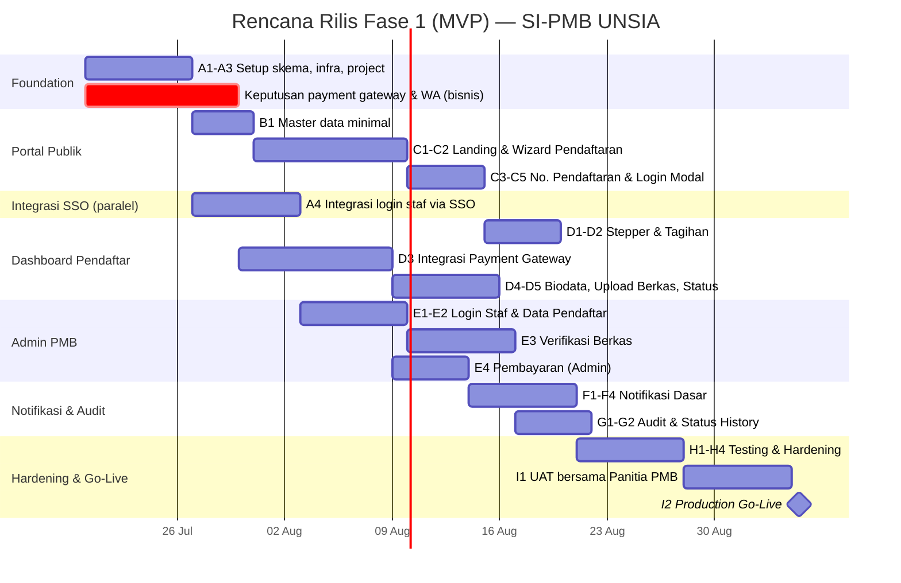

# Project Plan — SI-PMB UNSIA

## Sistem Informasi Penerimaan Mahasiswa Baru — Universitas Siber Asia

| Metadata | Keterangan |
|---|---|
| Terkait | BRD-SI-PMB-UNSIA.md, PRD-SI-PMB-UNSIA.md, ERD-SI-PMB-UNSIA.mermaid, Flow-Bisnis-SI-PMB-UNSIA.mermaid |
| Tech Stack | Next.js (App Router, fullstack), Drizzle ORM, PostgreSQL |
| Status saat ini | ⚪ Belum ada implementasi — baru dokumen BRD/PRD/ERD/Flow. Skema Drizzle belum dibuat |
| Dependensi eksternal | **SSO Platform** (untuk login staf Admin PMB) — lihat `Plan-SSO-Platform.md` |
| Versi | 1.0 |
| Tanggal | 12 Juli 2026 |

---

## 1. Ringkasan Eksekutif

Rencana ini menerjemahkan roadmap tingkat tinggi di PRD (§10) menjadi **Work Breakdown Structure (WBS)**, **urutan sprint**, dan **kebutuhan tim** untuk **Fase 1 (MVP)**: Portal Publik + Dashboard Pendaftar (pendaftaran, tagihan, upload berkas) + Admin PMB dasar (Data Pendaftar, Verifikasi, Pembayaran).

**Perbedaan penting dari SSO Platform**: di sini skema database *belum* dibuat sama sekali, jadi desain & migrasi Drizzle masuk sebagai task Sprint 0, bukan sesuatu yang sudah selesai.

**Dependensi kritis**: Admin PMB memakai login staf via SSO Platform (bukan login terpisah). Artinya Epic terkait login staf **baru bisa mulai setelah SSO Platform Fase 1 (MVP) — minimal modul OAuth2 core & dynamic role — sudah tersedia** di environment yang bisa diintegrasikan (staging/dev). Login pendaftar (calon mahasiswa) **tidak** bergantung pada SSO — itu tabel terpisah (`applicants`), jadi bisa dikerjakan paralel tanpa menunggu SSO.

---

## 2. Keputusan Bisnis yang Harus Diambil Lebih Dulu (Blocking)

Sesuai Open Questions di PRD §11, task berikut **memblokir** epic tertentu dan sebaiknya diputuskan sebelum/di awal Sprint 0:

| Keputusan | Memblokir | Urgensi |
|---|---|---|
| Payment gateway (Midtrans/Xendit/dll) | Epic D3 (integrasi pembayaran) | 🔴 Tinggi — perlu sandbox account di awal |
| Provider WhatsApp Business API / Email | Epic F (notifikasi otomatis) | 🟡 Sedang — bisa mulai dengan Email dulu, WA menyusul |
| Kebijakan retake ujian | Epic Fase 2 (CBT) | 🟢 Rendah untuk Fase 1 |
| Scope `commandcenter.html` | Tidak memblokir Fase 1 | 🟢 Rendah |
| Kebutuhan tahap interview/wawancara | Bisa mempengaruhi funnel di Fase 2 | 🟢 Rendah untuk Fase 1 |

---

## 3. Scope per Fase (rekap dari PRD, tidak berubah)

| Fase | Cakupan | Status |
|---|---|---|
| **Fase 1 (MVP)** | Portal Publik + Dashboard Pendaftar (pendaftaran, tagihan, upload berkas) + Admin PMB dasar (Data Pendaftar, Verifikasi, Pembayaran) | 🔵 Rencana ini |
| Fase 2 | Sistem Ujian CBT lengkap, Monitoring Funnel, Gelombang & Kuota (CRUD penuh) | ⚪ Belum |
| Fase 3 | Komunikasi & Kampanye penuh, integrasi SSO penuh untuk staf, analitik lanjutan | ⚪ Belum |

---

## 4. Work Breakdown Structure — Fase 1 (MVP)

### Epic A — Foundation & Infrastructure
| # | Task | Output |
|---|---|---|
| A1 | Desain & implementasi skema Drizzle (semua entitas Fase 1 — lihat `ERD-SI-PMB-UNSIA.mermaid`) | Migrasi siap |
| A2 | Setup project Next.js (App Router), struktur folder Portal Publik / Dashboard / Admin | Boilerplate siap |
| A3 | Setup environment (dev/staging/prod), CI/CD pipeline | Deploy otomatis |
| A4 | Integrasi login staf via SSO Platform — daftarkan "Admin PMB" sbg `application`, definisikan role dinamis (`super_admin_pmb`, `verifikator_berkas`, `staff_keuangan`, `staff_marketing`) | FR §7 — **butuh SSO Fase 1 sudah live** |

### Epic B — Master Data Minimal (prasyarat wizard pendaftaran)
> Catatan: CRUD penuh + UI pengaturan Gelombang & Kuota adalah Fase 2 (FR-D.7). Fase 1 cukup data minimal agar wizard bisa jalan.

| # | Task | Output |
|---|---|---|
| B1 | Tabel & seed/CRUD dasar `waves`, `entry_paths`, `study_programs`, `quotas` | Data dasar utk wizard |

### Epic C — Portal PMB Publik
| # | Task | Output |
|---|---|---|
| C1 | Landing page (info prodi, gelombang aktif, jalur) | FR-A.1 |
| C2 | Wizard pendaftaran 4 langkah (Gelombang → Jalur → Prodi → Data Diri) + validasi realtime | FR-A.2, FR-A.3 |
| C3 | Generate nomor pendaftaran unik + halaman sukses | FR-A.4 |
| C4 | Modal login untuk pendaftar existing → redirect Dashboard | FR-A.5 |
| C5 | Status gelombang dinamis (aktif/tertutup/belum dibuka) | FR-A.6 |

### Epic D — Dashboard Pendaftar
| # | Task | Output |
|---|---|---|
| D1 | Stepper visual 5 tahap (Buat Akun → Bayar → Data & Berkas → Ujian → Hasil) | FR-B.1 |
| D2 | Halaman tagihan (invoice formulir) | FR-B.2 |
| D3 | Integrasi payment gateway: create invoice, instruksi bayar per metode (VA/QRIS/E-Wallet/Transfer), webhook konfirmasi | FR-B.3, FR-B.4 — **butuh keputusan gateway (§2)** |
| D4 | Form biodata + upload berkas persyaratan, status per dokumen | FR-B.5, FR-B.6 |
| D5 | Logic auto-update status pendaftar (lunas + berkas lengkap → "Siap Ujian") | FR-B.7 (akses CBT-nya sendiri baru Fase 2) |

### Epic E — Admin PMB Dasar
| # | Task | Output |
|---|---|---|
| E1 | Login staf via SSO (pakai Epic A4) + role-based access ke panel | FR §7 |
| E2 | Data Pendaftar — tabel + filter (prodi, status) + detail drawer | FR-D.3 |
| E3 | Verifikasi Berkas — antrean, preview dokumen in-panel, approve/minta revisi (catatan wajib), notifikasi otomatis ke pendaftar | FR-D.4 |
| E4 | Pembayaran — tabel transaksi, rekonsiliasi via webhook, konfirmasi manual (fallback) | FR-D.5 |

### Epic F — Notifikasi Dasar (bukan kampanye penuh — itu Fase 3)
> Trigger otomatis minimal yang dibutuhkan agar alur end-to-end (PRD §8) berjalan, walau UI Kampanye & Template lengkap (FR-D.6) baru Fase 3.

| # | Task | Output |
|---|---|---|
| F1 | Integrasi provider Email (dan WA bila sudah diputuskan) | Prasyarat kirim notifikasi |
| F2 | Trigger: Welcome Email (setelah submit pendaftaran) | Alur §8 langkah 2 |
| F3 | Trigger: notifikasi status berkas berubah (approve/revisi) | FR-D.4 |
| F4 | Trigger: notifikasi pembayaran terkonfirmasi | Alur §8 langkah 4 |

### Epic G — Audit & Status History
| # | Task | Output |
|---|---|---|
| G1 | Pencatatan `applicant_status_history` di setiap perubahan tahap funnel | NFR Auditability |
| G2 | Pencatatan aktor staf (siapa verifikasi/konfirmasi apa, kapan) | NFR Auditability |

### Epic H — Testing & Hardening
| # | Task | Output |
|---|---|---|
| H1 | Test wizard pendaftaran (edge case validasi, submit ganda, dsb) | Kualitas alur pendaftaran |
| H2 | Test idempotensi webhook payment gateway (hindari duplikasi status lunas) | NFR Reliabilitas |
| H3 | Security test: dokumen tersimpan terenkripsi, URL dokumen tidak bisa diakses publik tanpa otorisasi | NFR Keamanan |
| H4 | Load test wizard & submit tagihan menjelang skenario "deadline gelombang" (lonjakan trafik) | NFR Performa/Skalabilitas |

### Epic I — Dokumentasi & Go-Live
| # | Task | Output |
|---|---|---|
| I1 | UAT bersama panitia PMB nyata (Verifikator, Staff Keuangan) | Validasi proses nyata |
| I2 | Deployment production + monitoring/alerting | Go-live |

---

## 5. Rencana Sprint (asumsi 1 sprint = 2 minggu, tim: 2 Backend, 1 Frontend, 1 QA paruh waktu)

| Sprint | Minggu | Fokus |
|---|---|---|
| Sprint 0 | 1 | A1–A3: skema, infra, project setup + **keputusan payment gateway/WA** (paralel, jalur bisnis) |
| Sprint 1 | 2–3 | B1, C1–C2: master data minimal + landing & wizard pendaftaran; A4 integrasi SSO berjalan paralel |
| Sprint 2 | 4–5 | C3–C5, D1–D2: nomor pendaftaran, login modal, stepper & tagihan; E1–E2 mulai (login staf & data pendaftar) |
| Sprint 3 | 6–7 | D3: integrasi payment gateway (blocking hingga keputusan gateway final) |
| Sprint 4 | 8–9 | D4–D5: biodata & upload berkas; E3: verifikasi berkas |
| Sprint 5 | 10–11 | E4: pembayaran admin; F1–F4: notifikasi dasar; G1–G2: audit |
| Sprint 6 | 12 | H1–H4: testing & hardening |
| Sprint 7 | 13–14 | I1: UAT bersama panitia PMB |
| Go-Live | 15 | I2: deployment production |

**Estimasi total Fase 1 (MVP): ± 15 minggu (~3.5–4 bulan)**, dengan asumsi SSO Platform Fase 1 sudah tersedia paling lambat di awal Sprint 2 (agar Epic A4/E1 tidak jadi bottleneck).

---

## 6. Kebutuhan Tim

| Peran | Alokasi | Fokus |
|---|---|---|
| Backend Engineer (2) | Full-time | Skema data, wizard & validasi, integrasi payment gateway/webhook, admin API |
| Frontend Engineer (1) | Full-time | Portal Publik, Dashboard Pendaftar, panel Admin PMB |
| QA Engineer (1) | Paruh waktu, intensif di Sprint 6–7 | Test webhook idempotensi, security dokumen, load test |
| Product/Tech Lead (1) | Paruh waktu | Kejar keputusan bisnis (§2), koordinasi dgn tim SSO, UAT bersama panitia |

---

## 7. Risiko & Mitigasi

| Risiko | Dampak | Mitigasi |
|---|---|---|
| SSO Platform belum siap saat Epic A4/E1 dimulai | Tinggi — Admin PMB tak bisa login | Koordinasikan timeline dgn tim SSO sejak awal; siapkan *stub*/mock auth sementara utk dev tanpa memblokir progress FE |
| Payment gateway belum diputuskan tepat waktu | Tinggi — Epic D3/E4 tertunda | Jadikan keputusan ini item pertama di Sprint 0, eskalasi ke pemilik produk bila belum ada jawaban H+3 |
| Duplikasi status "lunas" akibat webhook terkirim berkali-kali | Sedang | Idempotency key pada `payment_transactions`, test khusus (H2) |
| Dokumen sensitif (KTP, KK) bocor via URL publik | Tinggi | Signed URL berbatas waktu / akses via API dgn autentikasi, wajib masuk security test (H3) |
| Lonjakan trafik mendekati deadline gelombang bikin wizard lambat/gagal | Sedang | Load test dini (H4), pertimbangkan queue/rate limiting di submit tagihan |
| Scope creep — fitur Fase 2 (CBT, funnel monitoring) masuk lebih awal | Sedang | Product/Tech Lead menjaga batas scope sesuai WBS di atas |

---

## 8. Definition of Done — Fase 1 (MVP)

- [ ] Calon mahasiswa dapat mendaftar mandiri dari Portal Publik hingga mendapat nomor pendaftaran.
- [ ] Pendaftar dapat login, melihat tagihan, membayar via minimal 1 metode (sesuai gateway terpilih), dan status otomatis ter-update dari webhook.
- [ ] Pendaftar dapat melengkapi biodata & mengunggah seluruh berkas persyaratan, dengan status per dokumen yang jelas.
- [ ] Staf panitia (Verifikator, Keuangan, Super Admin) dapat login via SSO dan mengakses panel sesuai role masing-masing.
- [ ] Verifikator dapat approve/minta revisi dokumen, dan pendaftar menerima notifikasi otomatis.
- [ ] Staff Keuangan dapat melihat & merekonsiliasi transaksi pembayaran.
- [ ] Setiap perubahan status tercatat lengkap dengan aktor & waktu (audit trail).
- [ ] Dokumen pendaftar tidak dapat diakses tanpa otorisasi.
- [ ] Minimal 1 siklus UAT penuh bersama panitia PMB nyata berhasil dari daftar sampai berkas terverifikasi.

---

## 9. Setelah Go-Live (menuju Fase 2)

Prioritas Fase 2 sesuai PRD §10: **Sistem Ujian CBT lengkap** (5 modul, timer, auto-save, briefing), **Monitoring Funnel** (visualisasi 8 tahap + insight drop-off), dan **CRUD penuh Gelombang & Kuota**. Disarankan mulai desain teknis CBT (terutama kebijakan retake — open question §2) di paruh akhir Fase 1 agar tidak ada jeda pengembangan setelah go-live MVP.
