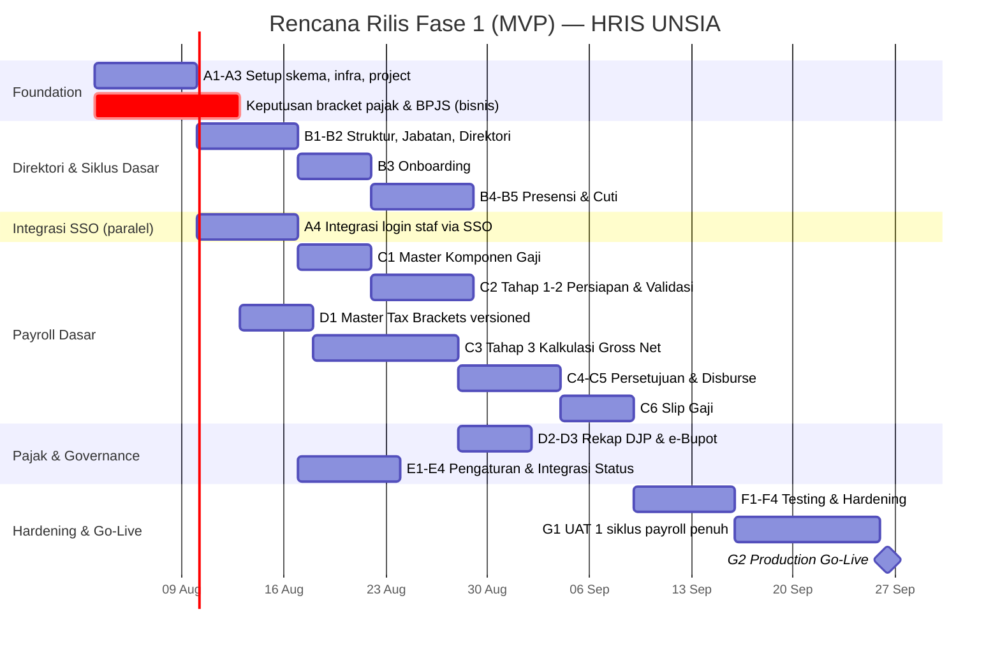

# Project Plan — HRIS UNSIA

## Human Resources Information System — Universitas Siber Asia

| Metadata | Keterangan |
|---|---|
| Terkait | BRD-HRIS-UNSIA.md, PRD-HRIS-UNSIA.md, ERD-HRIS-UNSIA.mermaid, Flow-Bisnis-HRIS-UNSIA.mermaid, Flow-Bisnis-HRIS-UNSIA-Payroll.mermaid |
| Tech Stack | Next.js (App Router, fullstack), Drizzle ORM, PostgreSQL (database privat `hris_db`, arsitektur microservices) |
| Status saat ini | ⚪ Belum ada implementasi — baru BRD/PRD/ERD/Flow |
| Dependensi eksternal | **SSO Platform** (login staf), **SIAKAD** (BKD & jadwal dosen, read-only), **Sistem Keuangan** (disbursement), sistem nasional **PDDikti/SISTER/BIMA** (push data dosen) |
| Versi | 1.0 |
| Tanggal | 12 Juli 2026 |

---

## 1. Ringkasan Eksekutif

Rencana ini membagi scope PRD (§10) menjadi WBS 3 fase. **Fase 1 (MVP)** difokuskan ke fondasi data pegawai + payroll dasar (5 tahap run) — karena payroll adalah proses bulanan kritis yang harus berjalan lebih dulu sebelum modul pendukung (mutasi, BKD, SKP) menyusul. Modul yang bergantung pada data eksternal kompleks (BKD dari SIAKAD, push ke PDDikti/SISTER/BIMA) diletakkan di fase belakangan agar tidak memblokir go-live payroll dasar.

**Ketergantungan kritis**: Login staf SDM via SSO — Epic terkait login **baru bisa mulai setelah SSO Platform Fase 1 (MVP)** sudah tersedia. Tahap Validasi Absensi & BKD payroll (FR-G.2) **baru bisa berfungsi penuh setelah SIAKAD** menyediakan endpoint BKD/jadwal — sebelum itu, Fase 1 bisa berjalan dengan **input manual sementara** sebagai fallback agar payroll tidak terhenti.

---

## 2. Keputusan yang Perlu Diambil Lebih Dulu (Blocking)

| Keputusan | Memblokir | Urgensi |
|---|---|---|
| Bracket PPh21 & tarif BPJS terkini (sumber kebenaran resmi) | Epic D (Pajak & BPJS) | 🔴 Tinggi — perlu sebelum kalkulasi payroll pertama |
| Format & jadwal integrasi SIAKAD untuk BKD/absensi dosen | Epic C2 (Validasi Payroll) | 🔴 Tinggi — fallback manual disiapkan bila belum siap |
| Mekanisme disbursement riil ke Sistem Keuangan (API/webhook spec) | Epic C5 (Disburse) | 🟡 Sedang — Fase 1 bisa mulai dengan status "siap disburse" tanpa eksekusi otomatis penuh |
| Protokol resmi PDDikti/SISTER/BIMA | Epic F (Fase 3) | 🟢 Rendah untuk Fase 1 |
| Relasi `HRIS.html` vs `SDM_Admins.html` (satu sistem, dua tampilan?) | Desain UI, bukan data model | 🟡 Sedang — perlu klarifikasi ke pemilik produk sebelum Sprint 0 selesai |

---

## 3. Scope per Fase

| Fase | Cakupan | Status |
|---|---|---|
| **Fase 1 (MVP)** | Direktori Pegawai + Onboarding, Presensi, Cuti, Struktur & Jabatan, Payroll dasar (5 tahap, dengan fallback manual utk BKD), Slip Gaji, Komponen Gaji, Pajak & BPJS dasar | 🔵 Rencana ini |
| Fase 2 | Mutasi & Promosi (+ validasi angka kredit), BKD Dosen (integrasi SIAKAD penuh), SKP/Penilaian Kinerja | ⚪ Belum |
| Fase 3 | Pelatihan & Sertifikasi + reminder, Laporan lengkap + Report Builder, integrasi PDDikti/SISTER/BIMA, integrasi penuh Sistem Keuangan | ⚪ Belum |

---

## 4. Work Breakdown Structure — Fase 1 (MVP)

### Epic A — Foundation & Infrastructure
| # | Task | Output |
|---|---|---|
| A1 | Desain & implementasi skema Drizzle (entitas Fase 1 — lihat `ERD-HRIS-UNSIA.mermaid`) | Migrasi siap |
| A2 | Setup project Next.js (App Router), struktur folder Admin SDM | Boilerplate siap |
| A3 | Setup environment (dev/staging/prod), CI/CD | Deploy otomatis |
| A4 | Integrasi login staf via SSO — daftarkan "HRIS" sbg `application`, role dinamis (`admin_data_sdm`, `admin_payroll`, `approver`, `super_admin_sdm`) | **Butuh SSO Fase 1 sudah live** |

### Epic B — Direktori Pegawai & Siklus Dasar
| # | Task | Output |
|---|---|---|
| B1 | CRUD `organization_units`, `positions` (master struktur & jabatan) | FR-E |
| B2 | Direktori pegawai (`employees`) — tabel, filter, profil biodata, rekening | FR-B.1–B.4 |
| B3 | Alur Onboarding — checklist kelengkapan, status draf → aktif | FR-B.5 |
| B4 | Presensi — pencatatan & rekap harian | FR-C |
| B5 | Cuti — master jenis, pengajuan, inbox persetujuan, saldo | FR-D |

### Epic C — Payroll Dasar (Prioritas Utama Fase 1)
| # | Task | Output |
|---|---|---|
| C1 | Master `payroll_components` (Pendapatan/Potongan/Tunjangan/Sertifikasi/Skema Khusus) | FR-I |
| C2 | Tahap 1–2: Persiapan Data + Validasi Absensi & BKD, dengan **fallback input manual** bila SIAKAD belum tersedia | FR-G.1, FR-G.2 |
| C3 | Tahap 3: Kalkulasi Gross & Net — PPh21 (bracket versioned) + BPJS | FR-G.3, FR-J.1–J.3 |
| C4 | Tahap 4: Persetujuan berjenjang | FR-G.1 |
| C5 | Tahap 5: Disburse (status "siap disburse", eksekusi via Sistem Keuangan menyusul) + generate `payslips` | FR-G.5 |
| C6 | Slip Gaji — cetak PDF, kirim email, distribusi massal | FR-H |

### Epic D — Pajak & Kepatuhan
| # | Task | Output |
|---|---|---|
| D1 | Master `tax_brackets` versioned (berlaku per rentang tanggal) | NFR Kepatuhan |
| D2 | Riwayat penyetoran DJP (rekap, belum submit otomatis) | FR-J.4 |
| D3 | Generate e-Bupot per karyawan (dokumen siap-setor) | FR-J.5 |

### Epic E — Admin & Governance
| # | Task | Output |
|---|---|---|
| E1 | Pengaturan: Profil Institusi, Kalender & Hari Libur | FR-O.1, FR-O.2 |
| E2 | Pengaturan: Parameter Payroll (versioned) | FR-O.3 |
| E3 | User & Hak Akses (integrasi SSO) + Audit Log | FR-O.4, FR-O.6 |
| E4 | Panel status Integrasi Sistem (indikator koneksi SIAKAD/Keuangan, last sync) | FR-O.5 |

### Epic F — Testing & Hardening
| # | Task | Output |
|---|---|---|
| F1 | Test kalkulasi payroll (kasus tepi: bracket pajak, komponen variabel, karyawan baru mid-periode) | Akurasi payroll |
| F2 | Test idempotensi webhook disbursement (hindari duplikasi pencairan) | NFR Reliabilitas |
| F3 | Security test: enkripsi data gaji/rekening, akses berbasis role | NFR Keamanan |
| F4 | Reproducibility test: hasil payroll periode lampau tidak berubah walau parameter terbaru diedit | NFR Akurasi |

### Epic G — Dokumentasi & Go-Live
| # | Task | Output |
|---|---|---|
| G1 | UAT bersama staf Biro SDM (Admin Data, Admin Payroll) menggunakan 1 siklus payroll penuh | Validasi proses nyata |
| G2 | Deployment production + monitoring/alerting | Go-live |

---

## 5. Rencana Sprint (asumsi 1 sprint = 2 minggu, tim: 2 Backend, 1 Frontend, 1 QA paruh waktu)

| Sprint | Minggu | Fokus |
|---|---|---|
| Sprint 0 | 1 | A1–A3: skema, infra, project + **keputusan bracket pajak/BPJS** (paralel, jalur bisnis) |
| Sprint 1 | 2–3 | B1–B2: struktur, jabatan, direktori pegawai; A4 integrasi SSO paralel |
| Sprint 2 | 4–5 | B3–B5: onboarding, presensi, cuti; C1 master komponen gaji |
| Sprint 3 | 6–7 | C2: persiapan & validasi payroll (fallback manual); D1: master tax brackets |
| Sprint 4 | 8–9 | C3: kalkulasi gross/net (PPh21+BPJS) |
| Sprint 5 | 10–11 | C4–C6: persetujuan, disburse, slip gaji; D2–D3: rekap DJP & e-Bupot |
| Sprint 6 | 12 | E1–E4: pengaturan & governance |
| Sprint 7 | 13 | F1–F4: testing & hardening |
| Sprint 8 | 14–15 | G1: UAT 1 siklus payroll penuh bersama Biro SDM |
| Go-Live | 16 | G2: deployment production |

**Estimasi total Fase 1 (MVP): ± 16 minggu (~4 bulan)**, dengan asumsi SSO Platform Fase 1 sudah tersedia paling lambat awal Sprint 1, dan bracket pajak/BPJS resmi sudah dikonfirmasi sebelum Sprint 3 (Epic C3 tidak bisa mulai tanpa ini).

---

## 6. Kebutuhan Tim

| Peran | Alokasi | Fokus |
|---|---|---|
| Backend Engineer (2) | Full-time | Skema data, engine kalkulasi payroll/pajak, integrasi SSO |
| Frontend Engineer (1) | Full-time | Admin SDM — direktori, onboarding, run payroll UI, slip gaji |
| QA Engineer (1) | Paruh waktu, intensif di Sprint 7–8 | Test akurasi kalkulasi payroll, security, idempotensi |
| Product/Tech Lead (1) | Paruh waktu | Kejar keputusan bisnis (§2), koordinasi dgn tim SIAKAD/Keuangan, UAT |
| Konsultan Payroll/Pajak (paruh waktu, opsional) | Sesuai kebutuhan | Validasi aturan PPh21/BPJS sesuai regulasi terkini |

---

## 7. Risiko & Mitigasi

| Risiko | Dampak | Mitigasi |
|---|---|---|
| SSO Platform belum siap saat Epic A4 dimulai | Tinggi — staf SDM tak bisa login | Koordinasi timeline dgn tim SSO; stub/mock auth sementara utk dev |
| SIAKAD belum menyediakan endpoint BKD/absensi dosen tepat waktu | Tinggi — Epic C2 tertunda | Fallback input manual dari awal (bagian desain, bukan tambalan darurat) |
| Kesalahan kalkulasi PPh21/BPJS akibat bracket usang/salah | Sangat Tinggi — dampak finansial & kepatuhan hukum | Validasi ganda dgn konsultan payroll, test kasus tepi ekstensif (F1) |
| Payroll pertama molor dari target disburse | Tinggi — dampak langsung ke seluruh pegawai | Buffer waktu memadai di jadwal (§5), UAT dgn data riil sebelum go-live |
| Data gaji/rekening bocor via akses tidak sah | Tinggi | Enkripsi wajib, audit log ketat, security test (F3) sebelum go-live |
| Scope creep — fitur Fase 2/3 (BKD penuh, PDDikti) masuk lebih awal | Sedang | Tech Lead menjaga batas scope sesuai WBS |

---

## 8. Definition of Done — Fase 1 (MVP)

- [ ] Staf Biro SDM dapat login via SSO dan mengakses panel sesuai role (Admin Data/Admin Payroll/Super Admin).
- [ ] Direktori pegawai (Dosen & Tendik) lengkap dengan filter unit/tipe/status.
- [ ] Pegawai baru dapat melalui alur onboarding hingga status Aktif.
- [ ] Presensi & cuti tercatat dan dapat diajukan/disetujui.
- [ ] Minimal 1 siklus payroll penuh berhasil dijalankan end-to-end (5 tahap) dengan data riil, termasuk kalkulasi PPh21 & BPJS yang tervalidasi konsultan.
- [ ] Slip gaji dapat diterbitkan & didistribusikan ke seluruh pegawai eligible.
- [ ] Hasil payroll periode lampau tidak berubah walau parameter pajak terbaru diedit (reproducibility teruji).
- [ ] Data sensitif (gaji, rekening) tidak dapat diakses tanpa otorisasi.
- [ ] Seluruh perubahan status pegawai & approval tercatat lengkap (audit trail).

---

## 9. Setelah Go-Live (menuju Fase 2)

Prioritas Fase 2 sesuai PRD §10: **BKD Dosen** (integrasi SIAKAD penuh, menggantikan fallback manual Fase 1 — jadikan ini prioritas pertama karena berdampak langsung ke akurasi payroll dosen), **Mutasi & Promosi** dengan validasi angka kredit otomatis, dan **SKP/Penilaian Kinerja**. Disarankan mulai koordinasi teknis dengan tim SIAKAD di paruh akhir Fase 1 agar transisi dari fallback manual ke integrasi otomatis berjalan mulus tanpa jeda payroll.
