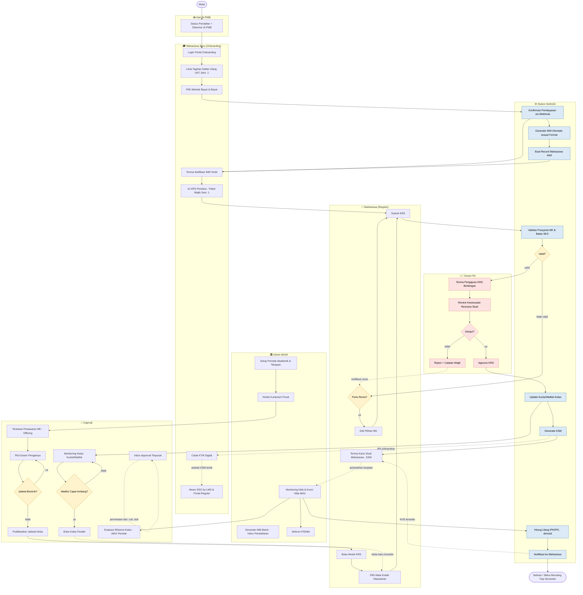

# ERD & Flow Bisnis — SIAKAD UNSIA

## Sistem Informasi Akademik Terpadu

| Metadata | Keterangan |
|---|---|
| Terkait | PRD-SIAKAD-UNSIA.md |
| Versi | 1.0 |
| Tanggal | 12 Juli 2026 |

> ⚠️ Portal Dosen belum punya mockup UI — node terkait Dosen PA pada Flow Bisnis ditandai warna merah muda (area yang butuh desain lanjutan).

---

## 1. Entity Relationship Diagram (ERD)

Skema data SIAKAD terbagi ke 7 domain: **Akademik/Master** (`study_programs`, `curricula`, `courses`), **Kelas & Pengajaran** (`classes`, `class_schedules`, `grade_components`, `learning_materials`), **Sivitas** (`students`, `lecturers`), **KRS & Penilaian** (`krs`, `krs_items`, `krs_approvals`, `grades`, `attendances`), **Onboarding & Keuangan** (`reregistration_invoices`, `spp_invoices`, `spp_payments`), **Layanan Mahasiswa** (`letter_requests`, `achievements`, `theses`), dan **Mutu/Governance** (`accreditation_criteria`, `pddikti_sync_logs`, `audit_logs`).

```mermaid
erDiagram

    %% ================= AKADEMIK / MASTER =================
    STUDY_PROGRAMS ||--o{ CURRICULA : "memiliki"
    STUDY_PROGRAMS ||--o{ STUDENTS : "menaungi"
    STUDY_PROGRAMS ||--o{ LECTURERS : "menaungi (homebase)"
    STUDY_PROGRAMS ||--o{ CLASSES : "menyelenggarakan"

    CURRICULA ||--o{ CURRICULUM_COURSES : "berisi"
    COURSES ||--o{ CURRICULUM_COURSES : "termasuk_dalam"
    COURSES ||--o{ COURSE_PREREQUISITES : "punya_prasyarat (course_id)"
    COURSES ||--o{ COURSE_PREREQUISITES : "menjadi_prasyarat (prerequisite_course_id)"
    COURSES ||--o{ CLASSES : "dibuka_sebagai"
    ACADEMIC_PERIODS ||--o{ CLASSES : "berlangsung_pada"
    ACADEMIC_PERIODS ||--o{ KRS : "untuk_periode"

    STUDY_PROGRAMS {
        uuid id PK
        string name
        string faculty
        string degree_level
        uuid kaprodi_lecturer_id FK
    }

    CURRICULA {
        uuid id PK
        uuid study_program_id FK
        string name
        int year_effective
        int total_sks
        int total_semester
        enum status "aktif|legacy"
        json cpl "capaian pembelajaran lulusan"
    }

    CURRICULUM_COURSES {
        uuid id PK
        uuid curriculum_id FK
        uuid course_id FK
        int semester_offered
        enum course_type "wajib_prodi|pilihan|mku|mbkm|skripsi"
    }

    COURSES {
        uuid id PK
        string code UK
        string name
        int sks
        enum type "wajib|pilihan"
        enum learning_mode "sync|async|hybrid"
        text description
        uuid coordinator_lecturer_id FK
    }

    COURSE_PREREQUISITES {
        uuid id PK
        uuid course_id FK
        uuid prerequisite_course_id FK
        boolean must_pass
    }

    ACADEMIC_PERIODS {
        uuid id PK
        string name "Ganjil 2026/2027"
        date start_date
        date end_date
        enum status "draft|berjalan|terjadwal|arsip"
        json stages "tahapan: KRS, UTS, UAS, masa sanggah nilai, dst"
    }

    %% ================= KELAS & PENGAJARAN =================
    CLASSES ||--o{ CLASS_CO_TEACHERS : "punya_tim_pendamping"
    LECTURERS ||--o{ CLASS_CO_TEACHERS : "mengajar_sbg_pendamping"
    LECTURERS ||--o{ CLASSES : "mengampu (dosen_utama_id)"
    CLASSES ||--o{ CLASS_SCHEDULES : "punya_jadwal_sesi"
    CLASSES ||--o{ GRADE_COMPONENTS : "punya_bobot_nilai"
    CLASSES ||--o{ LEARNING_MATERIALS : "punya_materi"
    CLASS_SCHEDULES ||--o{ LEARNING_MATERIALS : "materi_per_sesi"
    CLASS_SCHEDULES ||--o{ ATTENDANCES : "mencatat_kehadiran"

    CLASSES {
        uuid id PK
        uuid course_id FK
        uuid academic_period_id FK
        uuid study_program_id FK
        uuid dosen_utama_id FK
        string class_name "Kelas A / Kelas B PJJ"
        int capacity
        int enrolled_count
        int waitlist_count
        int waitlist_threshold_open_parallel
        enum mode "sync|async"
        enum status "draft|aktif|selesai"
        boolean grade_locked
    }

    CLASS_CO_TEACHERS {
        uuid id PK
        uuid class_id FK
        uuid lecturer_id FK
        string role_note "tim pengajar pendamping"
    }

    CLASS_SCHEDULES {
        uuid id PK
        uuid class_id FK
        int session_number
        string topic
        date session_date
        time start_time
        time end_time
        enum session_type "reguler|libur|uts|uas"
        string vc_link "utk kelas sync"
    }

    GRADE_COMPONENTS {
        uuid id PK
        uuid class_id FK "nullable jika pakai default global"
        string component_name "Tugas|Kuis|UTS|UAS|Kehadiran"
        decimal weight_percent
        boolean is_override
    }

    LEARNING_MATERIALS {
        uuid id PK
        uuid class_id FK
        uuid class_schedule_id FK
        enum material_type "file|video|tugas"
        string title
        string file_url
        enum status "belum_diisi|terunggah"
        timestamp uploaded_at
    }

    %% ================= SIVITAS =================
    STUDENTS ||--o{ KRS : "mengajukan"
    STUDENTS ||--o{ ACHIEVEMENTS : "mencatat"
    STUDENTS ||--o{ LETTER_REQUESTS : "mengajukan"
    STUDENTS ||--o{ THESES : "mengerjakan"
    STUDENTS ||--o{ REREGISTRATION_INVOICES : "menerima_tagihan"
    STUDENTS ||--o{ SPP_INVOICES : "menerima_tagihan"
    LECTURERS ||--o{ STUDENTS : "membimbing (dosen_pa_id)"
    LECTURERS ||--o{ THESES : "membimbing (pembimbing_id)"

    STUDENTS {
        uuid id PK
        string nim UK "null sebelum onboarding selesai"
        uuid pmb_applicant_ref "referensi ke applicants.id di SI-PMB"
        string full_name
        string birth_place
        date birth_date
        enum gender
        enum religion
        text address
        uuid study_program_id FK
        int angkatan
        int current_semester
        enum academic_status "aktif|cuti|lulus|keluar|drop_out"
        uuid dosen_pa_id FK
        enum entry_path "mandiri|beasiswa|karyawan|transfer"
        decimal ipk
        int total_sks_lulus
        uuid curriculum_id FK
        string campus_email
        string personal_email
        string phone
        string emergency_contact
        string sso_username
        enum account_status "aktif|suspend|reset_pending"
    }

    LECTURERS {
        uuid id PK
        string nidn UK
        string full_name
        uuid study_program_id FK "homebase"
        string position "jabatan fungsional"
        decimal bkd_load
        string sso_username
    }

    %% ================= KRS & PENILAIAN =================
    KRS ||--o{ KRS_ITEMS : "berisi"
    CLASSES ||--o{ KRS_ITEMS : "diambil_pada"
    KRS ||--o{ KRS_APPROVALS : "diproses_melalui"
    LECTURERS ||--o{ KRS_APPROVALS : "menyetujui (dosen_pa_id)"
    STUDENTS ||--o{ GRADES : "memperoleh"
    CLASSES ||--o{ GRADES : "menghasilkan"
    STUDENTS ||--o{ ATTENDANCES : "tercatat"

    KRS {
        uuid id PK
        uuid student_id FK
        uuid academic_period_id FK
        enum status "draft|diajukan|disetujui_pa|ditolak"
        int total_sks
        int max_sks_allowed "dihitung dari aturan ambang IPS"
        timestamp submitted_at
    }

    KRS_ITEMS {
        uuid id PK
        uuid krs_id FK
        uuid class_id FK
        enum status "diajukan|disetujui|ditolak"
    }

    KRS_APPROVALS {
        uuid id PK
        uuid krs_id FK
        uuid dosen_pa_id FK
        enum action "approve|reject"
        string note "wajib jika reject"
        timestamp decided_at
    }

    GRADES {
        uuid id PK
        uuid student_id FK
        uuid class_id FK
        decimal tugas_score
        decimal kuis_score
        decimal uts_score
        decimal uas_score
        decimal attendance_score
        decimal final_score
        string letter_grade
        decimal grade_point "angka mutu"
        boolean locked
        uuid graded_by_lecturer_id FK
    }

    ATTENDANCES {
        uuid id PK
        uuid student_id FK
        uuid class_schedule_id FK
        enum status "hadir|izin|alpa"
        string source "lms_sync|manual"
    }

    %% ================= ONBOARDING & KEUANGAN =================
    REREGISTRATION_INVOICES {
        uuid id PK
        uuid student_id FK "nullable sebelum NIM terbit, pakai pmb_applicant_ref"
        uuid pmb_applicant_ref
        string invoice_number UK
        decimal amount
        enum status "unpaid|paid|expired"
        date due_date
        timestamp paid_at
    }

    SPP_INVOICES {
        uuid id PK
        uuid student_id FK
        uuid academic_period_id FK
        decimal amount
        enum status "unpaid|paid|overdue"
        date due_date
    }

    SPP_PAYMENTS {
        uuid id PK
        uuid invoice_id FK "ref reregistration_invoices atau spp_invoices"
        enum invoice_source "reregistration|spp"
        enum method "virtual_account|qris|e_wallet"
        string provider_ref
        decimal amount
        timestamp paid_at
    }

    SPP_INVOICES ||--o{ SPP_PAYMENTS : "dibayar_melalui"
    REREGISTRATION_INVOICES ||--o{ SPP_PAYMENTS : "dibayar_melalui"

    %% ================= LAYANAN MAHASISWA =================
    LETTER_TYPES ||--o{ LETTER_REQUESTS : "mendefinisikan"

    LETTER_TYPES {
        uuid id PK
        string name "Surat Aktif Kuliah|Transkrip Sementara|Cuti Akademik"
        boolean requires_signature
    }

    LETTER_REQUESTS {
        uuid id PK
        uuid student_id FK
        uuid letter_type_id FK
        enum status "diajukan|diproses|selesai|ditutup"
        string result_file_url
        string signed_by_bsre
        timestamp requested_at
        timestamp completed_at
    }

    ACHIEVEMENTS {
        uuid id PK
        uuid student_id FK
        enum category "lomba|organisasi|sertifikasi|publikasi"
        string activity_name
        enum level "lokal|nasional|internasional"
        int year
        string evidence_file_url
        enum validation_status "menunggu|tervalidasi|ditolak"
    }

    THESES {
        uuid id PK
        uuid student_id FK
        uuid pembimbing_id FK
        string title
        enum stage "proposal|penelitian|sidang_akhir"
        int progress_percent
        enum sidang_status "belum_mengusulkan|terjadwal|selesai"
    }

    %% ================= MUTU & GOVERNANCE =================
    ACCREDITATION_CRITERIA {
        uuid id PK
        uuid study_program_id FK
        int criteria_number "1-9 BAN-PT"
        string criteria_name
        decimal target_score
        decimal current_score
        string evidence_file_url
        enum status "kurang|baik|sangat_baik"
    }

    PDDIKTI_SYNC_LOGS {
        uuid id PK
        string table_name
        int row_count
        timestamp synced_at
        enum status "sukses|gagal|berjalan"
    }

    AUDIT_LOGS {
        uuid id PK
        string actor_ref "ref SSO users.id"
        string entity_type
        uuid entity_id
        string action
        json detail
        timestamp created_at
    }

    STUDY_PROGRAMS ||--o{ ACCREDITATION_CRITERIA : "dinilai_pada"
```

---

## 2. Flow Bisnis

Alur bisnis end-to-end SIAKAD, 7 lane: **Dari SI-PMB**, **Mahasiswa Baru (Onboarding)**, **Admin BAAK**, **Kaprodi**, **Mahasiswa (Reguler)**, **Dosen PA** (node merah muda = UI belum ada), dan **Sistem SIAKAD**.

Dua sub-alur utama yang saling terhubung:

1. **Onboarding Mahasiswa Baru** — dari status "Diterima" di PMB → bayar UKT → NIM terbit → KRS perdana → KTM → akses portal reguler.
2. **Siklus KRS Semester Reguler** — Admin BAAK & Kaprodi menyiapkan periode/kurikulum/kelas → Mahasiswa isi KRS → validasi sistem → approval Dosen PA → KSM terbit → monitoring kelas & nilai → IPK/IPS terhitung ulang → siklus berulang tiap semester.

### Catatan — Gap Portal Dosen
Node `D1`–`D5` (approval KRS oleh Dosen PA) adalah titik kritis di alur ini — tanpa Portal Dosen, proses KRS tidak bisa selesai end-to-end. Prioritaskan desain mockup untuk area ini sebelum implementasi Fase 1 SIAKAD dimulai.
