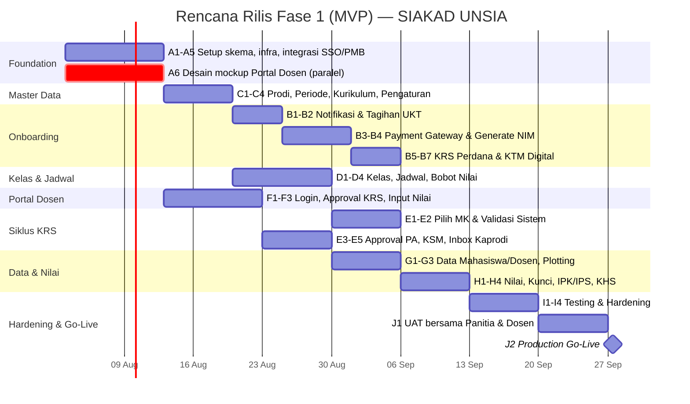

# Project Plan — SIAKAD UNSIA

## Sistem Informasi Akademik Terpadu

| Metadata | Keterangan |
|---|---|
| Terkait | PRD-SIAKAD-UNSIA.md, ERD-SIAKAD-UNSIA.mermaid, Flow-Bisnis-SIAKAD-UNSIA.mermaid, ERD-Integrasi-Lintas-Sistem.mermaid |
| Tech Stack | Next.js (App Router, fullstack), Drizzle ORM, PostgreSQL (**database bersama** dengan SSO & PMB — lihat Catatan-Integrasi-Lintas-Sistem.md) |
| Status saat ini | ⚪ Belum ada implementasi — baru PRD/ERD/Flow. Skema Drizzle belum dibuat |
| Dependensi eksternal | **SSO Platform** (login staf/dosen/mahasiswa), **SI-PMB** (sumber data mahasiswa via `applicant_id`) |
| Gap kritis | 🔴 **Portal Dosen belum punya mockup UI** — blocker untuk siklus KRS end-to-end |
| Versi | 1.0 |
| Tanggal | 12 Juli 2026 |

---

## 1. Ringkasan Eksekutif

Rencana ini menerjemahkan roadmap PRD (§10) menjadi WBS, sprint plan, dan kebutuhan tim untuk **Fase 1 (MVP)**: Onboarding mahasiswa baru, KRS reguler end-to-end, Data Mahasiswa/Dosen, Kelas & Jadwal dasar, Nilai & KHS dasar.

**Perbedaan penting dari plan sebelumnya**: SIAKAD punya **dua dependensi eksternal sekaligus** (SSO untuk login, PMB untuk sumber data mahasiswa) DAN satu **gap desain internal** (Portal Dosen). Karena FK ke `pmb_applicants` dan `sso_users` kini bersifat **sungguhan** (lihat Catatan Integrasi), migrasi skema SIAKAD **tidak bisa final** sebelum skema PMB & SSO minimal sudah stabil di database yang sama.

---

## 2. Prasyarat & Blocking Items

| Item | Jenis | Memblokir | Mitigasi |
|---|---|---|---|
| Skema PMB & SSO belum tentu final (masih dokumen) | Teknis | Migrasi `students.applicant_id`, `*.user_id` (FK asli) | Selaraskan urutan migrasi: SSO → PMB → SIAKAD, atau desain FK secara *deferred* (nullable dulu, di-enforce belakangan) |
| **Portal Dosen tidak ada mockup** | Desain | FR-C.3 (approval KRS), FR-D (nilai & materi) — inti siklus akademik | Desain mockup Portal Dosen di Sprint 0–1, paralel dengan setup infra (lihat Epic A6) |
| Kepastian "Daftar Ulang & UKT" masuk SIAKAD atau tetap di PMB | Bisnis | Epic B (onboarding) | Konfirmasi ke pemilik produk di awal Sprint 0 |
| Payment gateway untuk UKT — sama dengan PMB atau terpisah? | Bisnis | Epic B3 (integrasi bayar UKT) | Idealnya pakai gateway yang sama dengan PMB agar 1x integrasi |

---

## 3. Scope per Fase (rekap dari PRD, tidak berubah)

| Fase | Cakupan | Status |
|---|---|---|
| **Fase 1 (MVP)** | Onboarding mahasiswa baru, KRS reguler end-to-end (+ Portal Dosen minimal), Data Mahasiswa/Dosen, Kelas & Jadwal dasar, Nilai & KHS dasar | 🔵 Rencana ini |
| Fase 2 | Learning Material monitoring penuh, Absensi terintegrasi LMS, Persuratan digital + BSrE, SPP/keuangan penuh | ⚪ Belum |
| Fase 3 | Sinkron PDDikti, Laporan lanjutan, Akreditasi BAN-PT, Skripsi/TA monitoring, Prestasi/SKPI | ⚪ Belum |

---

## 4. Work Breakdown Structure — Fase 1 (MVP)

### Epic A — Foundation & Infrastructure
| # | Task | Output |
|---|---|---|
| A1 | Desain & migrasi skema Drizzle (entitas Fase 1, FK asli ke `sso_users` & `pmb_applicants`) | Migrasi siap |
| A2 | Setup project Next.js, struktur folder Onboarding/Mahasiswa/Dosen/Admin | Boilerplate siap |
| A3 | Setup environment dev/staging/prod, CI/CD | Deploy otomatis |
| A4 | Registrasi "SIAKAD Admin" sbg `application` di SSO + role dinamis (`admin_baak`, `kaprodi`, `dosen`) | FR §7 |
| A5 | Integrasi data: job/trigger yang membaca `pmb_applicants` berstatus "Diterima" → siap di-onboarding | FR-A.1, integrasi PMB |
| A6 | 🔴 **Desain mockup UI Portal Dosen** (approval KRS, input nilai, upload materi) | Prasyarat Epic F |

### Epic B — Portal Onboarding Mahasiswa Baru
| # | Task | Output |
|---|---|---|
| B1 | Notifikasi status lulus + roadmap administrasi | FR-A.1 |
| B2 | Tagihan Daftar Ulang UKT + instruksi bayar | FR-A.2 |
| B3 | Integrasi payment gateway UKT + webhook | FR-A.2 — **butuh keputusan gateway (§2)** |
| B4 | Generate NIM otomatis (sesuai format di Pengaturan) setelah bayar lunas | FR-A.3 |
| B5 | KRS perdana (paket wajib) + ajukan ke Dosen PA | FR-A.4 |
| B6 | Penerbitan KTM digital (QR verifikasi) | FR-A.5 |
| B7 | Buka akses SSO ke LMS & Portal Reguler setelah onboarding selesai | FR-A.6 |

### Epic C — Master Data Akademik (prasyarat KRS)
| # | Task | Output |
|---|---|---|
| C1 | CRUD `study_programs`, `academic_periods` (+ tahapan) | Prasyarat semua modul |
| C2 | CRUD `courses` (bank MK) + `course_prerequisites` | FR-E.2 |
| C3 | CRUD `curricula` + `curriculum_courses` (versi kurikulum, migrasi) | FR-E.2 |
| C4 | Pengaturan dasar: format NIM, skala nilai, ambang SKS vs IPS, bobot komponen nilai default | FR-E.15 |

### Epic D — Kelas & Penjadwalan
| # | Task | Output |
|---|---|---|
| D1 | CRUD `classes` (MK, periode, dosen utama+pendamping, kapasitas, waitlist threshold) | FR-E.3 |
| D2 | `class_schedules` — auto-generate sesi + resolver bentrok jadwal | FR-C.1, FR-E.4 |
| D3 | Logic buka kelas paralel otomatis saat waitlist capai ambang | FR-C.5 |
| D4 | `grade_components` (bobot nilai per kelas, override) | FR-E.3 |

### Epic E — Siklus KRS (inti bisnis)
| # | Task | Output |
|---|---|---|
| E1 | UI Mahasiswa: pilih MK ditawarkan, submit KRS | FR-B.3 |
| E2 | Validasi sistem: prasyarat MK lulus + batas SKS berbasis IPS | FR-C.2 |
| E3 | Approval KRS oleh Dosen PA (approve/reject + catatan) — **butuh Epic A6 selesai** | FR-C.3, FR-D.1 |
| E4 | Generate KSM setelah disetujui + update kuota/waitlist kelas | FR-C.4 |
| E5 | Inbox Approval Terpusat (Kaprodi) — sekaligus tempat approval lain (cuti dsb, versi dasar) | FR-F.2 |

### Epic F — Portal Dosen (Minimal Fase 1) 🔴
| # | Task | Output |
|---|---|---|
| F1 | Login dosen via SSO + lihat daftar mahasiswa bimbingan (Dosen PA) | Prasyarat E3 |
| F2 | Approve/reject KRS bimbingan | FR-D.1 |
| F3 | Input nilai per komponen untuk kelas yang diampu | FR-D.2 |
| F4 | (Opsional Fase 1, bisa digeser ke Fase 2) Upload materi ajar per sesi | FR-D.3 |

### Epic G — Data Mahasiswa & Dosen (Admin)
| # | Task | Output |
|---|---|---|
| G1 | Tabel & detail Data Mahasiswa (filter status, IPK/kehadiran rendah, kelola akun) | FR-E.8 |
| G2 | Tabel & detail Data Dosen + ekspor BKD dasar | FR-E.9 |
| G3 | Plotting Dosen (Kaprodi) — plot ke MK, publish, kirim ke Dosen PA | FR-F.4 |

### Epic H — Nilai & KHS Dasar
| # | Task | Output |
|---|---|---|
| H1 | Monitoring status input nilai per kelas (Admin BAAK) | FR-E.6 |
| H2 | Kunci nilai akhir semester | FR-E.6 |
| H3 | Hitung ulang IPK/IPS otomatis (derived dari `grades`) | NFR Konsistensi Data |
| H4 | Halaman KHS & Transkrip (Mahasiswa) | FR-B.4 |

### Epic I — Testing & Hardening
| # | Task | Output |
|---|---|---|
| I1 | Test alur onboarding end-to-end (bayar → NIM → KRS perdana → KTM) | Kualitas alur utama |
| I2 | Test idempotensi webhook UKT | NFR Reliabilitas |
| I3 | Test integritas FK lintas sistem (`applicant_id`, `user_id`) | Konsistensi data ERP |
| I4 | Security test dokumen & akses berbasis role granular (Admin BAAK vs Kaprodi) | NFR Keamanan |

### Epic J — Dokumentasi & Go-Live
| # | Task | Output |
|---|---|---|
| J1 | UAT bersama Admin BAAK, Kaprodi, & minimal 1 Dosen PA nyata | Validasi proses nyata |
| J2 | Deployment production + monitoring | Go-live |

---

## 5. Rencana Sprint (asumsi 1 sprint = 2 minggu, tim: 2 Backend, 1 Frontend, 1 UI/UX paruh waktu, 1 QA paruh waktu)

| Sprint | Minggu | Fokus |
|---|---|---|
| Sprint 0 | 1 | A1–A5: skema + integrasi SSO/PMB; **A6 mulai paralel** (desain Portal Dosen) |
| Sprint 1 | 2–3 | C1–C4: master data akademik & pengaturan dasar |
| Sprint 2 | 4–5 | B1–B4: notifikasi, tagihan UKT, payment gateway, generate NIM |
| Sprint 3 | 6 | B5–B7: KRS perdana & KTM; D1–D2 kelas & jadwal mulai paralel |
| Sprint 4 | 7–8 | D3–D4 selesai; F1–F3: Portal Dosen (jika A6 sudah selesai) |
| Sprint 5 | 9–10 | E1–E5: siklus KRS reguler penuh (pilih MK → validasi → approval PA → KSM) |
| Sprint 6 | 11–12 | G1–G3, H1–H4: data mahasiswa/dosen, nilai & KHS |
| Sprint 7 | 13 | I1–I4: testing & hardening |
| Sprint 8 | 14 | J1: UAT bersama panitia & dosen |
| Go-Live | 15 | J2: deployment production |

**Estimasi total Fase 1 (MVP): ± 15 minggu (~3.5–4 bulan)**, dengan syarat: (1) SSO Fase 1 & PMB Fase 1 sudah live sebelum Sprint 0 dimulai, (2) desain Portal Dosen (A6) rampung sebelum akhir Sprint 3 agar tidak menunda Epic E.

---

## 6. Kebutuhan Tim

| Peran | Alokasi | Fokus |
|---|---|---|
| Backend Engineer (2) | Full-time | Skema data lintas sistem, siklus KRS, integrasi payment/SSO/PMB |
| Frontend Engineer (1) | Full-time | Onboarding, Portal Mahasiswa, Portal Dosen, Admin BAAK/Kaprodi |
| UI/UX Designer (1) | Paruh waktu, intensif Sprint 0–2 | **Desain mockup Portal Dosen** (gap kritis) |
| QA Engineer (1) | Paruh waktu, intensif Sprint 7–8 | Test FK integritas, webhook, security |
| Product/Tech Lead (1) | Paruh waktu | Kejar keputusan bisnis (§2), koordinasi lintas tim SSO/PMB/SIAKAD, UAT |

---

## 7. Risiko & Mitigasi

| Risiko | Dampak | Mitigasi |
|---|---|---|
| Skema SSO/PMB berubah setelah SIAKAD mulai migrasi (FK ikut berubah) | Tinggi | Koordinasi rilis skema lintas tim; freeze skema inti SSO/PMB sebelum Sprint 0 SIAKAD |
| Desain Portal Dosen molor, menunda Epic E (KRS) | Tinggi | Prioritaskan A6 di minggu pertama, alokasikan UI/UX designer khusus |
| FK lintas sistem (`applicant_id`, `user_id`) melanggar independensi modul jika suatu saat perlu dipecah jadi microservices | Sedang | Dokumentasikan di Catatan-Integrasi-Lintas-Sistem.md; desain FK agar mudah "diputus" jadi soft-ref nanti bila perlu |
| Perhitungan IPK/IPS salah karena logic derived tidak konsisten dgn kebijakan skala nilai | Tinggi | Uji unit khusus utk kalkulasi nilai, validasi terhadap `Panduan Pengambilan KRS.html` & aturan di Pengaturan |
| Ambiguitas modul UKT (SIAKAD vs PMB) menyebabkan pengerjaan ganda | Sedang | Klarifikasi ke pemilik produk sebelum Sprint 2 (Epic B3) |

---

## 8. Definition of Done — Fase 1 (MVP)

- [ ] Mahasiswa baru (dari PMB) dapat menyelesaikan onboarding penuh: bayar UKT → NIM terbit → isi KRS perdana → KTM digital.
- [ ] Mahasiswa reguler dapat mengisi KRS tiap semester dengan validasi prasyarat & batas SKS otomatis.
- [ ] **Dosen dapat login dan approve/reject KRS bimbingannya** (Portal Dosen minimal berhasil dibangun).
- [ ] KSM diterbitkan otomatis setelah KRS disetujui, dan kuota/waitlist kelas ter-update.
- [ ] Admin BAAK & Kaprodi dapat mengelola kurikulum, kelas, dan memonitor nilai sesuai role masing-masing.
- [ ] IPK/IPS terhitung otomatis dan konsisten dengan data `grades`.
- [ ] Seluruh FK lintas sistem (ke `sso_users`, `pmb_applicants`) tervalidasi tanpa data yatim (orphan).
- [ ] Minimal 1 siklus UAT penuh bersama Admin BAAK, Kaprodi, dan Dosen PA nyata.

---

## 9. Setelah Go-Live (menuju Fase 2)

Prioritas Fase 2 sesuai PRD §10: **Learning Material** penuh (upload materi dosen — jika belum sempat Fase 1), **Absensi** terintegrasi LMS, **Persuratan digital + BSrE**, **SPP/keuangan** penuh di luar UKT awal. Disarankan konsolidasi keputusan master data bersama SSO (lihat Catatan-Integrasi-Lintas-Sistem.md §"Peluang Konsolidasi") dievaluasi di awal Fase 2, sebelum modul Persuratan dibangun (karena berpotensi memakai `ref_items` SSO untuk jenis surat).
