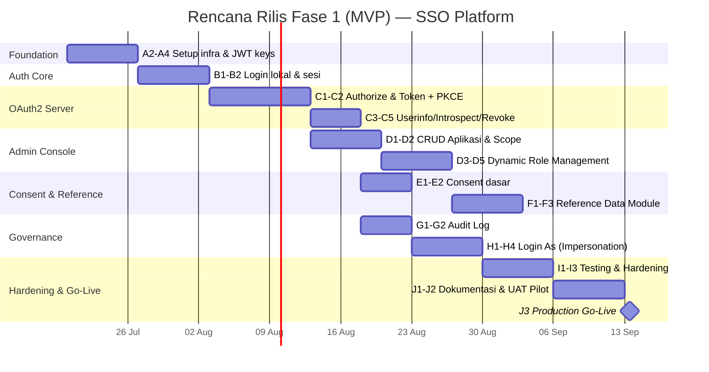

# Project Plan — SSO Platform

## Dynamic OAuth2 Identity Provider

| Metadata | Keterangan |
|---|---|
| Terkait | BRD-SSO-Platform.md, PRD-SSO-Platform.md, ERD-SSO-Platform.mermaid, Flow-Bisnis-SSO-Platform.mermaid |
| Tech Stack | Next.js (App Router, fullstack), Drizzle ORM, PostgreSQL |
| Status saat ini | ✅ Skema database (Drizzle) sudah selesai dibuat — implementasi API & UI belum dimulai |
| Versi | 1.0 |
| Tanggal | 11 Juli 2026 |

---

## 1. Ringkasan Eksekutif

Rencana ini menerjemahkan roadmap tingkat tinggi di PRD (§10) menjadi **Work Breakdown Structure (WBS)**, **urutan sprint**, dan **tim yang dibutuhkan**, khusus untuk **Fase 1 (MVP)** — termasuk fitur **Login As (Impersonation)** yang baru disepakati ditambahkan ke scope MVP karena sifatnya krusial untuk operasional support sejak hari pertama.

Karena skema database sudah selesai (lihat `schema/` — 7 modul: `users`, `applications`, `rbac`, `oauth`, `reference`, `audit`, `relations`), tim bisa langsung mulai dari lapisan API tanpa menunggu desain data lebih lanjut.

---

## 2. Scope per Fase (rekap dari PRD, tidak berubah)

| Fase | Cakupan | Status |
|---|---|---|
| **Fase 1 (MVP)** | Core OAuth2 flow, dynamic client registration, dynamic role per app, reference data module, audit log dasar, **Login As (impersonation)** | 🔵 Rencana ini |
| Fase 2 | Consent management UI lengkap, MFA, token introspection caching, admin analytics | ⚪ Belum |
| Fase 3 | Federasi IdP eksternal (Google/Microsoft), Single Log-Out, multi-tenant organizations penuh | ⚪ Belum |

---

## 3. Work Breakdown Structure — Fase 1 (MVP)

### Epic A — Foundation & Infrastructure
| # | Task | Output |
|---|---|---|
| A1 | ~~Desain & implementasi skema Drizzle~~ | ✅ Selesai |
| A2 | Setup project Next.js (App Router) + struktur folder API/admin console | Boilerplate siap |
| A3 | Setup environment (dev/staging/prod), CI/CD pipeline | Deploy otomatis |
| A4 | Generate RS256 key pair untuk signing JWT + endpoint `/.well-known/jwks.json` | Infra token siap |

### Epic B — Identity & Auth Core
| # | Task | Output |
|---|---|---|
| B1 | Register/login lokal (username/password), hashing argon2/bcrypt | `users` aktif |
| B2 | Session management (cookie/JWT sesi internal SSO) | Sesi login SSO |

### Epic C — OAuth2 Server (inti bisnis)
| # | Task | Output |
|---|---|---|
| C1 | `GET /oauth/authorize` — cek sesi, render login/consent | FR-4.1 |
| C2 | `POST /oauth/token` — exchange code/refresh_token + validasi PKCE | FR-4.2, FR-4.7 |
| C3 | `GET /oauth/userinfo` — profil + role user per aplikasi | FR-4.3 |
| C4 | `POST /oauth/introspect` | FR-4.4 |
| C5 | `POST /oauth/revoke` | FR-4.5 |

### Epic D — Dynamic Client & Role Management (Admin Console)
| # | Task | Output |
|---|---|---|
| D1 | CRUD Aplikasi Klien (Super Admin) — generate `client_id`/`client_secret`, rotasi | FR-1 |
| D2 | CRUD Scope global | FR-2 |
| D3 | CRUD Role dinamis per aplikasi (App Owner) | FR-3.1–3.2 |
| D4 | Assign/revoke role ke user per aplikasi | FR-3.3–3.4 |
| D5 | Role klaim disertakan di token/userinfo | FR-3.5 |

### Epic E — Consent (versi dasar untuk MVP)
| # | Task | Output |
|---|---|---|
| E1 | Consent screen dasar saat otorisasi pertama | FR-5.1 |
| E2 | Halaman profil: lihat & cabut consent | FR-5.2 |

### Epic F — Reference Data Module
| # | Task | Output |
|---|---|---|
| F1 | CRUD `ref_categories` & `ref_items` (hierarkis) | FR-6.1, FR-6.3 |
| F2 | API publik `GET /api/reference/{category_code}` | FR-6.2 |
| F3 | CRUD `organizations` & `user_organizations` | FR-6.4 |

### Epic G — Audit Log
| # | Task | Output |
|---|---|---|
| G1 | Helper/middleware pencatatan otomatis di semua write operation | FR-7.1 |
| G2 | UI viewer audit log (Super Admin, filterable) | FR-8.1 |

### Epic H — Login As (Impersonation) 🆕
| # | Task | Output |
|---|---|---|
| H1 | Backend: validasi role Super Admin, buat `impersonation_sessions` + token terpisah | Lihat Flow Bisnis §0 |
| H2 | UI: menu cari user + form alasan wajib | — |
| H3 | Banner sesi aktif "Sedang login sebagai..." + tombol akhiri sesi | — |
| H4 | Audit log level tinggi (mulai/akhir sesi) + notifikasi opsional ke target user | Governance |

### Epic I — Testing & Hardening
| # | Task | Output |
|---|---|---|
| I1 | Unit & integration test alur OAuth2 end-to-end | Regresi aman |
| I2 | Security test: PKCE bypass, token replay, brute-force login, rate limiting | NFR Keamanan |
| I3 | Load test `/oauth/token` — target < 300ms p95 | NFR Performa |

### Epic J — Dokumentasi & Go-Live
| # | Task | Output |
|---|---|---|
| J1 | Dokumentasi integrasi untuk App Owner (cara daftar aplikasi & konsumsi OAuth2) | Onboarding aplikasi lain |
| J2 | UAT dengan 1 aplikasi pilot (mis. SI-PMB UNSIA) di staging | Validasi end-to-end nyata |
| J3 | Deployment production + monitoring/alerting (uptime 99.9%) | Go-live |

---

## 4. Rencana Sprint (asumsi 1 sprint = 2 minggu, tim: 2 Backend, 1 Frontend, 1 QA paruh waktu)

| Sprint | Minggu | Fokus |
|---|---|---|
| Sprint 0 | 1 | A2–A4: Setup project, infra, JWT keys |
| Sprint 1 | 2–3 | B1–B2, C1–C2: Login lokal + inti OAuth2 (authorize, token, PKCE) |
| Sprint 2 | 4–5 | C3–C5, D1–D2: sisa endpoint OAuth2 + CRUD aplikasi/scope |
| Sprint 3 | 6–7 | D3–D5, E1–E2: dynamic role management + consent dasar |
| Sprint 4 | 8–9 | F1–F3, G1–G2: reference data module + audit log |
| Sprint 5 | 10 | H1–H4: fitur Login As (impersonation) |
| Sprint 6 | 11 | I1–I3: testing & hardening keamanan/performa |
| Sprint 7 | 12–13 | J1–J2: dokumentasi integrasi + UAT dengan aplikasi pilot |
| Go-Live | 14 | J3: deployment production |

**Estimasi total Fase 1 (MVP): ± 14 minggu (~3.5 bulan)** sejak schema sudah selesai.

---

## 5. Kebutuhan Tim

| Peran | Alokasi | Fokus |
|---|---|---|
| Backend Engineer (2) | Full-time | OAuth2 core, RBAC, audit, impersonation |
| Frontend Engineer (1) | Full-time | Admin console, halaman login/consent, profil user |
| QA Engineer (1) | Paruh waktu, intensif di Sprint 6–7 | Security & load testing |
| Product/Tech Lead (1) | Paruh waktu | Review, UAT bersama App Owner pilot |

---

## 6. Risiko & Mitigasi

| Risiko | Dampak | Mitigasi |
|---|---|---|
| PKCE/OAuth2 diimplementasikan tidak sesuai spesifikasi (celah keamanan) | Tinggi | Gunakan library OAuth2 teruji (mis. `node-oidc-provider`) sebagai basis, jangan full custom bila memungkinkan; wajib security test di Sprint 6 |
| Aplikasi pilot (App Owner) belum siap integrasi saat UAT | Sedang | Sediakan dokumentasi & SDK contoh (Epic J1) lebih awal, mulai koordinasi sejak Sprint 3 |
| Fitur Login As disalahgunakan tanpa terdeteksi | Tinggi | Audit log wajib (H4) + review berkala log impersonation oleh atasan Super Admin, pertimbangkan notifikasi otomatis ke target user |
| Endpoint `/oauth/token` tidak capai target < 300ms p95 | Sedang | Load test dini (I3), indexing tabel token, JWT stateless agar verifikasi tak selalu hit DB |
| Scope creep (fitur Fase 2/3 masuk lebih awal) | Sedang | Product/Tech Lead menjaga batas scope tiap sprint sesuai WBS di atas |

---

## 7. Definition of Done — Fase 1 (MVP)

- [ ] Aplikasi eksternal dapat login via SSO menggunakan Authorization Code + PKCE end-to-end.
- [ ] Super Admin dapat mendaftarkan aplikasi baru tanpa deploy ulang kode SSO.
- [ ] App Owner dapat membuat role baru & assign ke user tanpa melibatkan tim SSO.
- [ ] Reference data dapat diakses lintas aplikasi via API publik.
- [ ] Seluruh write operation (termasuk Login As) tercatat di audit log.
- [ ] Super Admin dapat login as user lain dengan alasan wajib & sesi dapat diakhiri kapan saja.
- [ ] `/oauth/token` p95 < 300ms pada load test.
- [ ] Minimal 1 aplikasi pilot berhasil UAT end-to-end di staging.

---

## 8. Setelah Go-Live (menuju Fase 2)

Prioritaskan sesuai umpan balik UAT pilot, kandidat awal Fase 2: MFA (BR-10), consent management UI lengkap, token introspection caching, admin analytics — lihat PRD §10 untuk detail lengkap.
