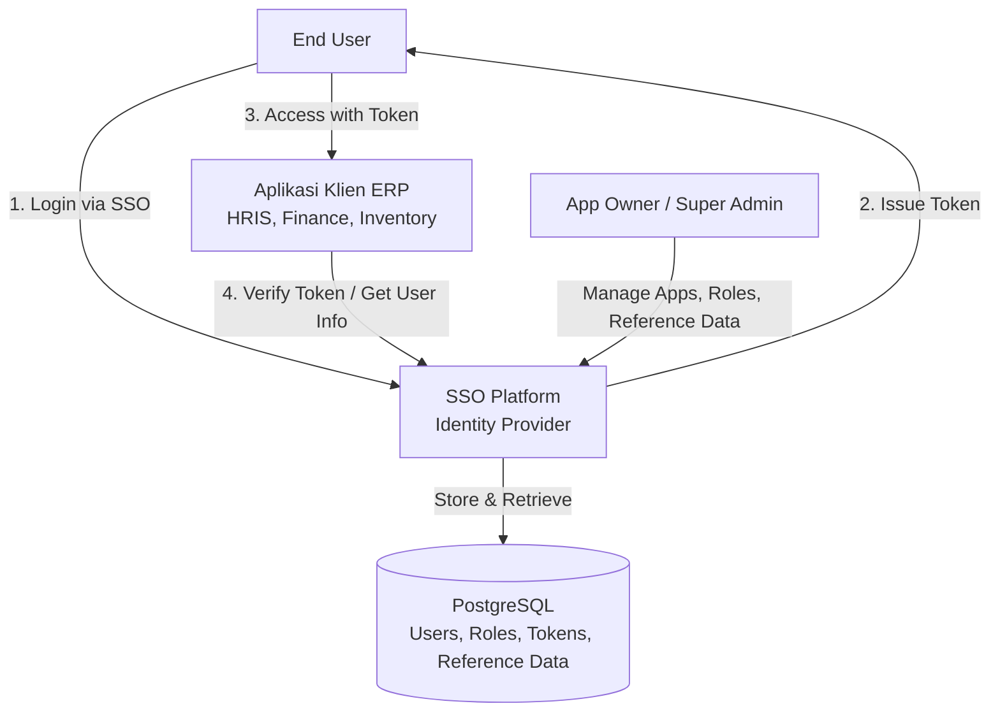
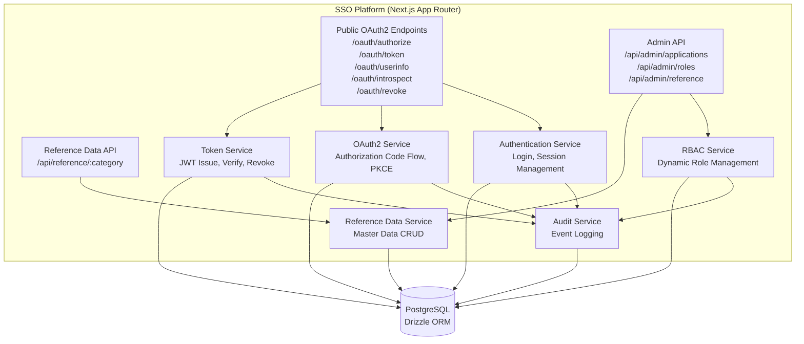
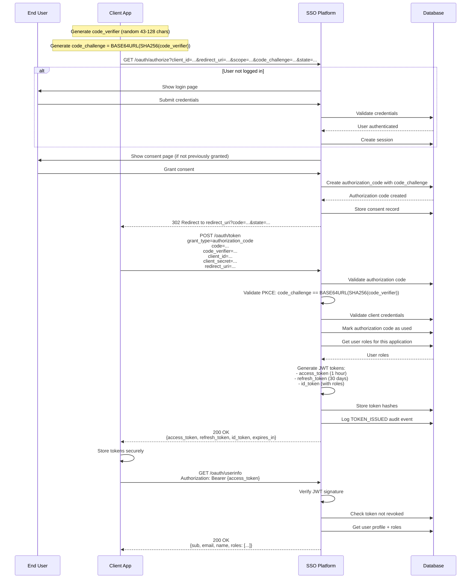
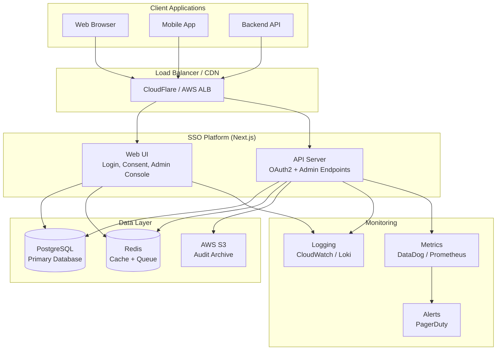

# Design Document: SSO Platform — Dynamic OAuth2 Identity Provider

## Overview

SSO Platform adalah Identity Provider (IdP) internal berbasis OAuth2 Authorization Code Flow + PKCE yang menyediakan single sign-on untuk ekosistem ERP perusahaan. Platform ini mendukung **dynamic client registration** (aplikasi baru didaftarkan via admin console tanpa redeploy), **dynamic role management per aplikasi** (setiap aplikasi mendefinisikan role-nya sendiri), dan **standalone reference data module** untuk master data yang dapat digunakan lintas aplikasi ERP.

Tech stack: Next.js (App Router, fullstack), Drizzle ORM, PostgreSQL, JWT dengan RS256 untuk token signing.

Fase 1 (MVP) mencakup: core OAuth2 flow dengan PKCE, dynamic client & role management, reference data module, admin console untuk Super Admin dan App Owner, serta audit log dasar.

---

## Architecture

### System Context Diagram



### High-Level Architecture




### Component Responsibilities


| Component | Responsibility |
|-----------|----------------|
| **Authentication Service** | Mengelola login user, session management, password verification |
| **OAuth2 Service** | Implementasi Authorization Code Flow + PKCE, generate authorization codes, validate PKCE parameters |
| **Token Service** | Issue JWT (access, refresh, id tokens), verify token signature, revoke tokens, publish JWKS |
| **RBAC Service** | Dynamic role & permission management per aplikasi, role assignment ke user |
| **Reference Data Service** | CRUD master data (categories, items), query hierarkis, digunakan lintas aplikasi ERP |
| **Audit Service** | Log seluruh aktivitas otentikasi, administrasi, dan perubahan data sensitif |

---

## Components and Interfaces

### 1. Authentication Service

**Purpose**: Menangani otentikasi user, session management, dan validasi kredensial.

**Interface**:
```typescript
interface IAuthenticationService {
  // Otentikasi dengan username/password
  authenticate(
    username: string, 
    password: string
  ): Promise<AuthResult>
  
  // Buat session baru setelah login berhasil
  createSession(userId: string): Promise<Session>
  
  // Validasi session yang ada
  validateSession(sessionId: string): Promise<SessionValidationResult>
  
  // Logout dan hapus session
  destroySession(sessionId: string): Promise<void>
  
  // Change password
  changePassword(
    userId: string, 
    oldPassword: string, 
    newPassword: string
  ): Promise<void>
}

type AuthResult = 
  | { success: true; user: User }
  | { success: false; error: AuthError }

type AuthError = 
  | "INVALID_CREDENTIALS"
  | "USER_INACTIVE"
  | "USER_LOCKED"
  | "MFA_REQUIRED"

interface Session {
  id: string
  userId: string
  expiresAt: Date
  createdAt: Date
}

type SessionValidationResult =
  | { valid: true; userId: string }
  | { valid: false; reason: "EXPIRED" | "NOT_FOUND" }
```


**Responsibilities**:
- Validasi kredensial user terhadap password hash di database
- Generate dan manage session cookies/tokens
- Enforce password policy (min length, complexity)
- Log authentication attempts untuk audit

---

### 2. OAuth2 Service

**Purpose**: Implementasi OAuth2 Authorization Code Flow dengan PKCE sesuai RFC 7636.

**Interface**:
```typescript
interface IOAuth2Service {
  // Generate authorization code setelah user consent
  createAuthorizationCode(params: AuthCodeParams): Promise<AuthorizationCode>
  
  // Validasi authorization code saat token exchange
  validateAuthorizationCode(
    code: string,
    codeVerifier: string,
    clientId: string,
    redirectUri: string
  ): Promise<AuthCodeValidation>
  
  // Exchange code menjadi tokens
  exchangeCodeForTokens(
    code: string,
    codeVerifier: string,
    clientId: string,
    clientSecret: string,
    redirectUri: string
  ): Promise<TokenResponse>
  
  // Refresh access token
  refreshAccessToken(
    refreshToken: string,
    clientId: string,
    clientSecret: string
  ): Promise<TokenResponse>
  
  // Validate PKCE challenge
  validatePKCEChallenge(
    codeVerifier: string,
    codeChallenge: string,
    method: "S256" | "plain"
  ): boolean
}

interface AuthCodeParams {
  userId: string
  applicationId: string
  redirectUri: string
  scope: string
  codeChallenge: string
  codeChallengeMethod: "S256" | "plain"
}

interface AuthorizationCode {
  code: string
  expiresAt: Date
}

type AuthCodeValidation =
  | { valid: true; userId: string; applicationId: string; scope: string }
  | { valid: false; error: "EXPIRED" | "INVALID" | "ALREADY_USED" | "PKCE_MISMATCH" }

interface TokenResponse {
  accessToken: string
  refreshToken: string
  idToken: string
  tokenType: "Bearer"
  expiresIn: number
  scope: string
}
```


**Responsibilities**:
- Implementasi PKCE (RFC 7636) untuk mencegah authorization code interception
- Validasi redirect URI terhadap whitelist aplikasi
- Generate cryptographically secure authorization codes
- Enforce authorization code expiration (10 menit)
- Tandai authorization code sebagai "used" setelah token exchange

---

### 3. Token Service

**Purpose**: Mengelola lifecycle JWT tokens (access, refresh, id tokens).

**Interface**:
```typescript
interface ITokenService {
  // Issue tokens setelah authorization code exchange
  issueTokens(params: TokenIssuanceParams): Promise<TokenSet>
  
  // Verify dan decode access token
  verifyAccessToken(token: string): Promise<TokenPayload | null>
  
  // Revoke access token
  revokeAccessToken(token: string): Promise<void>
  
  // Revoke refresh token
  revokeRefreshToken(token: string): Promise<void>
  
  // Introspect token (untuk resource server)
  introspectToken(token: string): Promise<TokenIntrospection>
  
  // Get user info dari access token
  getUserInfo(accessToken: string): Promise<UserInfo>
  
  // Generate JWKS untuk public key distribution
  getJWKS(): Promise<JWKS>
}

interface TokenIssuanceParams {
  userId: string
  applicationId: string
  scope: string
}

interface TokenSet {
  accessToken: string  // JWT signed dengan RS256
  refreshToken: string // Opaque token
  idToken: string      // JWT berisi user profile + roles
  expiresIn: number    // dalam detik
}

interface TokenPayload {
  sub: string          // user ID
  aud: string          // application client_id
  scope: string
  exp: number
  iat: number
  jti: string          // token ID
}
```


interface TokenIntrospection {
  active: boolean
  scope?: string
  client_id?: string
  username?: string
  token_type?: "Bearer"
  exp?: number
  iat?: number
  sub?: string
}

interface UserInfo {
  sub: string
  email: string
  email_verified: boolean
  name: string
  preferred_username: string
  roles: string[]  // roles for the requesting application
}

interface JWKS {
  keys: JWK[]
}

interface JWK {
  kty: "RSA"
  use: "sig"
  kid: string
  alg: "RS256"
  n: string    // RSA modulus
  e: string    // RSA exponent
}
```

**Responsibilities**:
- Generate JWT dengan RS256 signing
- Publish public key via `/.well-known/jwks.json`
- Store token hash (bukan plaintext) di database untuk revocation check
- Enforce token expiration (access token: 1 jam, refresh token: 30 hari)
- Include user roles dalam id_token dan userinfo response

---

### 4. RBAC Service

**Purpose**: Dynamic role & permission management per aplikasi.

**Interface**:
```typescript
interface IRBACService {
  // === Role Management ===
  createRole(params: CreateRoleParams): Promise<Role>
  updateRole(roleId: string, params: UpdateRoleParams): Promise<Role>
  deleteRole(roleId: string): Promise<void>
  getRolesByApplication(applicationId: string): Promise<Role[]>
  
  // === Permission Management ===
  createPermission(params: CreatePermissionParams): Promise<Permission>
  deletePermission(permissionId: string): Promise<void>
  assignPermissionToRole(roleId: string, permissionId: string): Promise<void>
  removePermissionFromRole(roleId: string, permissionId: string): Promise<void>
  
  // === User Role Assignment ===
  assignRoleToUser(params: RoleAssignmentParams): Promise<UserRole>
  revokeRoleFromUser(userId: string, applicationId: string, roleId: string): Promise<void>
  getUserRoles(userId: string, applicationId: string): Promise<Role[]>
  getUserPermissions(userId: string, applicationId: string): Promise<Permission[]>
}
```


interface CreateRoleParams {
  applicationId: string
  roleKey: string        // unique per app, e.g., "finance_approver"
  roleName: string       // display name
  description?: string
  isDefault: boolean     // auto-assign ke user baru?
}

interface UpdateRoleParams {
  roleName?: string
  description?: string
  isDefault?: boolean
}

interface CreatePermissionParams {
  applicationId: string
  permissionKey: string  // e.g., "invoice:approve"
  description?: string
}

interface RoleAssignmentParams {
  userId: string
  applicationId: string
  roleId: string
  grantedBy: string      // admin user ID
}

interface Role {
  id: string
  applicationId: string
  roleKey: string
  roleName: string
  description: string | null
  isDefault: boolean
  createdAt: Date
}

interface Permission {
  id: string
  applicationId: string
  permissionKey: string
  description: string | null
}

interface UserRole {
  id: string
  userId: string
  applicationId: string
  roleId: string
  grantedBy: string
  grantedAt: Date
  status: "active" | "revoked"
}
```

**Responsibilities**:
- Validasi roleKey unique per aplikasi
- Validasi permissionKey unique per aplikasi
- Enforce authorization: hanya App Owner atau Super Admin yang bisa manage role aplikasi tersebut
- Log semua role assignment/revocation

---


### 5. Reference Data Service

**Purpose**: Standalone master data module untuk digunakan lintas aplikasi ERP.

**Interface**:
```typescript
interface IReferenceDataService {
  // === Category Management ===
  createCategory(params: CreateCategoryParams): Promise<RefCategory>
  updateCategory(categoryId: string, params: UpdateCategoryParams): Promise<RefCategory>
  deleteCategory(categoryId: string): Promise<void>
  getCategories(): Promise<RefCategory[]>
  getCategoryByCode(code: string): Promise<RefCategory | null>
  
  // === Item Management ===
  createItem(params: CreateItemParams): Promise<RefItem>
  updateItem(itemId: string, params: UpdateItemParams): Promise<RefItem>
  deleteItem(itemId: string): Promise<void>
  getItemsByCategory(categoryCode: string): Promise<RefItem[]>
  getItemHierarchy(categoryCode: string): Promise<RefItemTree[]>
  
  // === Organization Management ===
  createOrganization(params: CreateOrgParams): Promise<Organization>
  updateOrganization(orgId: string, params: UpdateOrgParams): Promise<Organization>
  getOrganizationHierarchy(): Promise<OrgTree[]>
  assignUserToOrganization(params: UserOrgAssignment): Promise<void>
}

interface CreateCategoryParams {
  code: string           // e.g., "JABATAN", "STATUS_PEGAWAI"
  name: string
  description?: string
}

interface UpdateCategoryParams {
  name?: string
  description?: string
}

interface CreateItemParams {
  categoryId: string
  parentId?: string      // untuk hierarki
  code: string
  name: string
  extraValue?: Record<string, any>  // JSON flexible
  sortOrder: number
  isActive: boolean
}

interface UpdateItemParams {
  parentId?: string
  code?: string
  name?: string
  extraValue?: Record<string, any>
  sortOrder?: number
  isActive?: boolean
}
```


interface CreateOrgParams {
  code: string
  name: string
  parentId?: string
  type: "company" | "division" | "department"
  isActive: boolean
}

interface UpdateOrgParams {
  name?: string
  parentId?: string
  type?: "company" | "division" | "department"
  isActive?: boolean
}

interface UserOrgAssignment {
  userId: string
  organizationId: string
  positionRefItemId?: string  // ref ke JABATAN
  isPrimary: boolean
}

interface RefCategory {
  id: string
  code: string
  name: string
  description: string | null
  createdAt: Date
}

interface RefItem {
  id: string
  categoryId: string
  parentId: string | null
  code: string
  name: string
  extraValue: Record<string, any> | null
  sortOrder: number
  isActive: boolean
}

interface RefItemTree extends RefItem {
  children: RefItemTree[]
}

interface Organization {
  id: string
  code: string
  name: string
  parentId: string | null
  type: "company" | "division" | "department"
  isActive: boolean
}

interface OrgTree extends Organization {
  children: OrgTree[]
}
```

**Responsibilities**:
- Validasi uniqueness category code & item code dalam kategori
- Query hierarkis (rekursif) untuk tree structure
- Soft delete (set isActive = false) untuk data historis
- Expose via public API `/api/reference/{categoryCode}` untuk konsumsi aplikasi ERP

---


### 6. Audit Service

**Purpose**: Log seluruh aktivitas otentikasi dan administrasi untuk compliance dan forensik.

**Interface**:
```typescript
interface IAuditService {
  log(event: AuditEvent): Promise<void>
  query(params: AuditQueryParams): Promise<AuditLog[]>
  getRecentActivity(userId: string, limit: number): Promise<AuditLog[]>
}

interface AuditEvent {
  actorUserId: string
  action: AuditAction
  entityType: string    // e.g., "user", "application", "role"
  entityId: string
  metadata?: Record<string, any>
}

type AuditAction =
  | "LOGIN_SUCCESS"
  | "LOGIN_FAILURE"
  | "LOGOUT"
  | "TOKEN_ISSUED"
  | "TOKEN_REVOKED"
  | "APPLICATION_CREATED"
  | "APPLICATION_UPDATED"
  | "ROLE_CREATED"
  | "ROLE_ASSIGNED"
  | "ROLE_REVOKED"
  | "CONSENT_GRANTED"
  | "CONSENT_REVOKED"
  | "REFERENCE_DATA_CREATED"
  | "REFERENCE_DATA_UPDATED"

interface AuditQueryParams {
  actorUserId?: string
  action?: AuditAction
  entityType?: string
  entityId?: string
  startDate?: Date
  endDate?: Date
  limit?: number
  offset?: number
}

interface AuditLog {
  id: string
  actorUserId: string
  action: AuditAction
  entityType: string
  entityId: string
  metadata: Record<string, any> | null
  createdAt: Date
}
```

**Responsibilities**:
- Non-blocking async logging (queue-based jika perlu)
- Immutable audit log (no updates, no deletes)
- Index untuk query performa (by actor, by action, by entity, by date)
- Retention policy enforcement (arsip log > 1 tahun ke cold storage)

---


## Data Models

### User & Identity

```typescript
interface User {
  id: string              // UUID
  username: string        // unique
  email: string           // unique
  passwordHash: string    // bcrypt/argon2
  fullName: string
  status: "active" | "inactive" | "locked"
  mfaEnabled: boolean
  createdAt: Date
  updatedAt: Date
}

interface UserIdentity {
  id: string
  userId: string
  provider: "local" | "google" | "microsoft"
  providerUserId: string
  createdAt: Date
}
```

**Validation Rules**:
- `username`: alphanumeric + underscore, 3-50 karakter
- `email`: valid email format
- `passwordHash`: min 8 karakter (sebelum hash), kombinasi huruf, angka, simbol
- `status`: default "active", "locked" setelah 5 failed login attempts

---

### Application & Scope

```typescript
interface Application {
  id: string
  clientId: string           // unique, generated (24 char alphanumeric)
  clientSecretHash: string   // bcrypt hash
  name: string
  description: string | null
  redirectUris: string[]     // JSON array
  allowedGrantTypes: string[] // ["authorization_code", "refresh_token"]
  logoUrl: string | null
  ownerUserId: string
  status: "active" | "inactive"
  createdAt: Date
  updatedAt: Date
}

interface Scope {
  id: string
  code: string               // e.g., "openid", "profile", "email", "erp:read"
  description: string | null
}

interface ApplicationScope {
  id: string
  applicationId: string
  scopeId: string
}
```

**Validation Rules**:
- `redirectUris`: must be valid HTTPS URLs (allow http://localhost for dev)
- `clientId`: auto-generated cryptographically secure
- `clientSecret`: 32 char random, shown once, stored as hash
- Minimal scopes untuk semua app: `openid`, `profile`

---


### OAuth2 Runtime

```typescript
interface OAuthAuthorizationCode {
  id: string
  code: string               // unique, 64 char random
  userId: string
  applicationId: string
  redirectUri: string
  scope: string              // space-separated
  codeChallenge: string
  codeChallengeMethod: "S256" | "plain"
  expiresAt: Date           // 10 minutes from creation
  used: boolean
  createdAt: Date
}

interface OAuthAccessToken {
  id: string
  tokenHash: string          // SHA256 hash of JWT
  userId: string
  applicationId: string
  scope: string
  expiresAt: Date           // 1 hour from creation
  createdAt: Date
  revoked: boolean
}

interface OAuthRefreshToken {
  id: string
  tokenHash: string          // SHA256 hash
  accessTokenId: string
  expiresAt: Date           // 30 days from creation
  revoked: boolean
  createdAt: Date
}

interface OAuthConsent {
  id: string
  userId: string
  applicationId: string
  scope: string              // space-separated
  grantedAt: Date
  revokedAt: Date | null
}
```

**Validation Rules**:
- `code`: single-use only, mark `used = true` after exchange
- `codeChallenge`: required (PKCE mandatory)
- `expiresAt` untuk authorization code: 10 menit
- `expiresAt` untuk access token: 1 jam (configurable per app)
- `expiresAt` untuk refresh token: 30 hari (configurable per app)
- Store token hash, never plaintext

---


### Dynamic RBAC

```typescript
interface ApplicationRole {
  id: string
  applicationId: string
  roleKey: string            // unique per app, e.g., "finance_approver"
  roleName: string           // display name
  description: string | null
  isDefault: boolean
  createdAt: Date
}

interface Permission {
  id: string
  applicationId: string
  permissionKey: string      // e.g., "invoice:approve", "report:view"
  description: string | null
}

interface RolePermission {
  id: string
  roleId: string
  permissionId: string
}

interface UserApplicationRole {
  id: string
  userId: string
  applicationId: string
  roleId: string
  grantedBy: string          // admin user ID
  grantedAt: Date
  status: "active" | "revoked"
}
```

**Validation Rules**:
- `roleKey`: unique per `applicationId`, alphanumeric + underscore
- `permissionKey`: unique per `applicationId`, format `resource:action`
- User dapat punya multiple roles untuk satu aplikasi
- Role assignment hanya bisa dilakukan oleh App Owner atau Super Admin

---

### Reference Data

```typescript
interface RefCategory {
  id: string
  code: string               // unique, uppercase, e.g., "JABATAN"
  name: string
  description: string | null
  createdAt: Date
}

interface RefItem {
  id: string
  categoryId: string
  parentId: string | null    // self-reference untuk hierarki
  code: string               // unique per category
  name: string
  extraValue: Record<string, any> | null  // JSON flexible
  sortOrder: number
  isActive: boolean
}
```


interface Organization {
  id: string
  code: string               // unique, e.g., "HRD", "FIN"
  name: string
  parentId: string | null    // self-reference untuk unit hierarki
  type: "company" | "division" | "department"
  isActive: boolean
}

interface UserOrganization {
  id: string
  userId: string
  organizationId: string
  positionRefItemId: string | null  // link ke RefItem kategori JABATAN
  isPrimary: boolean         // unit kerja utama user
}
```

**Validation Rules**:
- `code`: unique per category/organization, uppercase
- `parentId`: prevent circular reference
- `extraValue`: max size 10KB JSON
- `isPrimary`: hanya boleh 1 per user

---

## Main Algorithm/Workflow

### OAuth2 Authorization Code + PKCE Flow




---

## Key Functions with Formal Specifications

### Function 1: `validatePKCEChallenge()`

```typescript
function validatePKCEChallenge(
  codeVerifier: string,
  codeChallenge: string,
  method: "S256" | "plain"
): boolean
```

**Preconditions:**
- `codeVerifier` is a non-empty string with length 43-128 characters
- `codeChallenge` is a non-empty string
- `method` is either "S256" or "plain"

**Postconditions:**
- Returns `true` if and only if the challenge verification succeeds
- For `method = "S256"`: returns `true` iff `codeChallenge === BASE64URL(SHA256(codeVerifier))`
- For `method = "plain"`: returns `true` iff `codeChallenge === codeVerifier`
- No side effects on any parameters or global state

**Loop Invariants:** N/A (no loops)

---

### Function 2: `issueTokens()`

```typescript
async function issueTokens(params: TokenIssuanceParams): Promise<TokenSet>
```

**Preconditions:**
- `params.userId` is a valid user ID in the database
- `params.applicationId` is a valid application ID in the database
- `params.scope` is a space-separated string of valid scopes
- User has active status (not locked or inactive)
- Application has active status

**Postconditions:**
- Returns `TokenSet` containing valid JWT access token, opaque refresh token, and JWT id token
- Access token expires in 3600 seconds (1 hour)
- Refresh token expires in 2592000 seconds (30 days)
- Id token contains user claims: `sub`, `email`, `name`, `roles` (roles for this application)
- Token hashes are stored in database (`oauth_access_tokens`, `oauth_refresh_tokens`)
- Audit log entry created with action `TOKEN_ISSUED`
- All tokens are cryptographically secure

**Loop Invariants:**
- When fetching user roles: all processed roles belong to the specified application
- Role accumulation maintains uniqueness (no duplicate roles in final list)

---


### Function 3: `exchangeCodeForTokens()`

```typescript
async function exchangeCodeForTokens(
  code: string,
  codeVerifier: string,
  clientId: string,
  clientSecret: string,
  redirectUri: string
): Promise<TokenResponse>
```

**Preconditions:**
- `code` is a non-empty string matching an existing authorization code
- `codeVerifier` is a string with length 43-128 characters
- `clientId` and `clientSecret` match a valid application in database
- `redirectUri` matches the URI stored with the authorization code
- Authorization code has not expired (within 10 minutes of creation)
- Authorization code has not been used before (`used = false`)

**Postconditions:**
- Returns `TokenResponse` with access_token, refresh_token, id_token
- Authorization code is marked as `used = true` in database
- PKCE validation passed: `code_challenge === BASE64URL(SHA256(codeVerifier))`
- Tokens are issued for the user and application associated with the authorization code
- On failure (expired code, wrong verifier, wrong client, used code): throws error and no tokens issued
- Idempotency: calling twice with same code results in error on second call

**Loop Invariants:** N/A (no loops)

---

### Function 4: `getUserRoles()`

```typescript
async function getUserRoles(
  userId: string, 
  applicationId: string
): Promise<Role[]>
```

**Preconditions:**
- `userId` is a valid user ID
- `applicationId` is a valid application ID

**Postconditions:**
- Returns array of `Role` objects assigned to user for specified application
- Only roles with `status = "active"` are included
- Roles are ordered by `grantedAt` timestamp (oldest first)
- If user has no roles for application: returns empty array `[]`
- No side effects (read-only operation)

**Loop Invariants:**
- When iterating through role assignments: all processed roles have `status = "active"`
- Role accumulation maintains order by `grantedAt`

---


### Function 5: `assignRoleToUser()`

```typescript
async function assignRoleToUser(params: RoleAssignmentParams): Promise<UserRole>
```

**Preconditions:**
- `params.userId` is a valid user ID
- `params.applicationId` is a valid application ID
- `params.roleId` is a valid role ID belonging to the specified application
- `params.grantedBy` is a valid admin user ID with permission to manage roles for this application
- User does not already have this specific role assigned (no duplicate assignments)

**Postconditions:**
- Returns `UserRole` object representing the new assignment
- New row inserted into `user_application_roles` with `status = "active"`
- `grantedAt` is set to current timestamp
- Audit log entry created with action `ROLE_ASSIGNED`
- If assignment already exists but was revoked: reactivates it (update status to "active")

**Loop Invariants:** N/A (no loops)

---

### Function 6: `createAuthorizationCode()`

```typescript
async function createAuthorizationCode(params: AuthCodeParams): Promise<AuthorizationCode>
```

**Preconditions:**
- `params.userId` is a valid user ID
- `params.applicationId` is a valid application ID
- `params.redirectUri` is in the application's whitelist (`redirectUris`)
- `params.scope` is a space-separated list of scopes allowed for this application
- `params.codeChallenge` is a non-empty base64url string
- `params.codeChallengeMethod` is "S256" or "plain"

**Postconditions:**
- Returns `AuthorizationCode` with cryptographically random `code` (64 characters)
- Code is unique in database (collision check)
- `expiresAt` is set to current time + 10 minutes
- `used` is set to `false`
- Code and all parameters stored in `oauth_authorization_codes` table
- No tokens issued yet (tokens issued only on subsequent exchange)

**Loop Invariants:** N/A (no loops)

---


## Algorithmic Pseudocode

### Main OAuth2 Authorization Code Exchange Algorithm

```typescript
async function handleTokenRequest(request: TokenRequest): Promise<TokenResponse> {
  // INPUT: TokenRequest with grant_type, code, code_verifier, client_id, client_secret, redirect_uri
  // OUTPUT: TokenResponse with access_token, refresh_token, id_token, expires_in
  
  // PRECONDITION: All required fields present in request
  // POSTCONDITION: Valid tokens issued OR error thrown
  
  // Step 1: Validate client credentials
  const application = await db.applications.findOne({
    where: { clientId: request.client_id, status: 'active' }
  })
  
  if (!application) {
    throw new OAuth2Error('invalid_client', 'Client not found or inactive')
  }
  
  const clientSecretValid = await bcrypt.compare(
    request.client_secret, 
    application.clientSecretHash
  )
  
  if (!clientSecretValid) {
    await auditService.log({
      actorUserId: 'system',
      action: 'LOGIN_FAILURE',
      entityType: 'application',
      entityId: application.id,
      metadata: { reason: 'invalid_client_secret' }
    })
    throw new OAuth2Error('invalid_client', 'Invalid client credentials')
  }
  
  // Step 2: Retrieve and validate authorization code
  const authCode = await db.oauthAuthorizationCodes.findOne({
    where: { code: request.code }
  })
  
  if (!authCode) {
    throw new OAuth2Error('invalid_grant', 'Authorization code not found')
  }
  
  // INVARIANT: authCode exists and belongs to valid user and application
  
  if (authCode.used) {
    // Potential authorization code replay attack
    await revokeAllTokensForAuthCode(authCode.id)
    throw new OAuth2Error('invalid_grant', 'Authorization code already used')
  }
  
  if (new Date() > authCode.expiresAt) {
    throw new OAuth2Error('invalid_grant', 'Authorization code expired')
  }
  
  if (authCode.applicationId !== application.id) {
    throw new OAuth2Error('invalid_grant', 'Code issued for different client')
  }
  
  if (authCode.redirectUri !== request.redirect_uri) {
    throw new OAuth2Error('invalid_grant', 'Redirect URI mismatch')
  }
```


  
  // Step 3: Validate PKCE challenge
  const pkceValid = validatePKCEChallenge(
    request.code_verifier,
    authCode.codeChallenge,
    authCode.codeChallengeMethod
  )
  
  if (!pkceValid) {
    await auditService.log({
      actorUserId: authCode.userId,
      action: 'TOKEN_ISSUED',
      entityType: 'authorization_code',
      entityId: authCode.id,
      metadata: { success: false, reason: 'pkce_mismatch' }
    })
    throw new OAuth2Error('invalid_grant', 'PKCE verification failed')
  }
  
  // Step 4: Mark authorization code as used (prevent replay)
  await db.oauthAuthorizationCodes.update({
    where: { id: authCode.id },
    data: { used: true }
  })
  
  // Step 5: Fetch user and validate status
  const user = await db.users.findOne({ where: { id: authCode.userId } })
  
  if (!user || user.status !== 'active') {
    throw new OAuth2Error('invalid_grant', 'User not found or inactive')
  }
  
  // Step 6: Fetch user roles for this application
  const userRoles = await getUserRoles(user.id, application.id)
  const roleNames = userRoles.map(r => r.roleName)
  
  // INVARIANT: All roles in roleNames belong to specified application
  
  // Step 7: Generate tokens
  const accessToken = await generateAccessToken({
    userId: user.id,
    applicationId: application.id,
    scope: authCode.scope,
    expiresIn: 3600  // 1 hour
  })
  
  const refreshToken = await generateRefreshToken({
    accessTokenId: accessToken.id,
    expiresIn: 2592000  // 30 days
  })
  
  const idToken = await generateIdToken({
    userId: user.id,
    applicationId: application.id,
    scope: authCode.scope,
    roles: roleNames,
    email: user.email,
    name: user.fullName,
    expiresIn: 3600
  })
  
  // Step 8: Store token hashes in database
  await db.oauthAccessTokens.create({
    tokenHash: sha256(accessToken.jwt),
    userId: user.id,
    applicationId: application.id,
    scope: authCode.scope,
    expiresAt: new Date(Date.now() + 3600000),
    revoked: false
  })
```


  
  await db.oauthRefreshTokens.create({
    tokenHash: sha256(refreshToken.token),
    accessTokenId: accessToken.id,
    expiresAt: new Date(Date.now() + 2592000000),
    revoked: false
  })
  
  // Step 9: Audit log
  await auditService.log({
    actorUserId: user.id,
    action: 'TOKEN_ISSUED',
    entityType: 'application',
    entityId: application.id,
    metadata: { 
      scope: authCode.scope,
      grantType: 'authorization_code'
    }
  })
  
  // POSTCONDITION: Tokens issued, authorization code marked used, audit logged
  
  return {
    access_token: accessToken.jwt,
    refresh_token: refreshToken.token,
    id_token: idToken.jwt,
    token_type: 'Bearer',
    expires_in: 3600,
    scope: authCode.scope
  }
}
```

**Algorithm Complexity:**
- Time: O(1) for most operations, O(R) for fetching user roles where R = number of roles per user (typically small)
- Space: O(R) for storing role list

**Preconditions:**
- Request contains all required fields: `grant_type`, `code`, `code_verifier`, `client_id`, `client_secret`, `redirect_uri`
- Database is accessible and consistent
- Cryptographic functions (bcrypt, sha256, JWT sign) are available

**Postconditions:**
- Valid tokens returned OR exception thrown
- Authorization code marked as used
- Token hashes stored in database
- Audit log entry created

**Loop Invariants:**
- Role accumulation: all processed roles belong to the specified application and have active status

---


### PKCE Validation Algorithm

```typescript
function validatePKCEChallenge(
  codeVerifier: string,
  codeChallenge: string,
  method: "S256" | "plain"
): boolean {
  // INPUT: codeVerifier (43-128 chars), codeChallenge, method
  // OUTPUT: boolean indicating validation success
  
  // PRECONDITION: codeVerifier.length >= 43 && codeVerifier.length <= 128
  // PRECONDITION: codeChallenge is non-empty
  // PRECONDITION: method is "S256" or "plain"
  
  if (codeVerifier.length < 43 || codeVerifier.length > 128) {
    return false
  }
  
  if (method === "S256") {
    // SHA256 hash of verifier, then base64url encode
    const hash = crypto.createHash('sha256')
      .update(codeVerifier)
      .digest()
    
    const computedChallenge = base64url.encode(hash)
    
    return computedChallenge === codeChallenge
  } else if (method === "plain") {
    // Plain method: challenge equals verifier
    return codeVerifier === codeChallenge
  }
  
  // POSTCONDITION: Returns true iff challenge verification succeeds
  // POSTCONDITION: No side effects
  
  return false
}
```

**Algorithm Complexity:**
- Time: O(n) where n = length of codeVerifier (for SHA256 hashing)
- Space: O(1) - constant space for hash computation

**Preconditions:**
- `codeVerifier` length is between 43 and 128 characters (RFC 7636 requirement)
- `method` is either "S256" (recommended) or "plain"

**Postconditions:**
- Returns boolean result
- No mutations to any parameters or global state
- For S256: true iff `codeChallenge === BASE64URL(SHA256(codeVerifier))`
- For plain: true iff `codeChallenge === codeVerifier`

---


### Dynamic Role Assignment Algorithm

```typescript
async function assignRoleToUser(params: RoleAssignmentParams): Promise<UserRole> {
  // INPUT: userId, applicationId, roleId, grantedBy (admin user ID)
  // OUTPUT: UserRole record
  
  // PRECONDITION: All IDs are valid UUIDs
  // PRECONDITION: grantedBy has permission to manage roles for applicationId
  
  // Step 1: Validate entities exist
  const user = await db.users.findOne({ where: { id: params.userId } })
  if (!user) {
    throw new Error('User not found')
  }
  
  const application = await db.applications.findOne({ 
    where: { id: params.applicationId } 
  })
  if (!application) {
    throw new Error('Application not found')
  }
  
  const role = await db.applicationRoles.findOne({ 
    where: { 
      id: params.roleId,
      applicationId: params.applicationId  // Ensure role belongs to app
    } 
  })
  if (!role) {
    throw new Error('Role not found or does not belong to application')
  }
  
  // Step 2: Check admin permission
  const admin = await db.users.findOne({ where: { id: params.grantedBy } })
  if (!admin) {
    throw new Error('Granting user not found')
  }
  
  const hasPermission = await checkAdminPermission(
    params.grantedBy, 
    params.applicationId
  )
  if (!hasPermission) {
    throw new Error('Insufficient permission to assign roles')
  }
  
  // Step 3: Check for existing assignment
  const existingAssignment = await db.userApplicationRoles.findOne({
    where: {
      userId: params.userId,
      applicationId: params.applicationId,
      roleId: params.roleId
    }
  })
  
  let result: UserRole
  
  if (existingAssignment) {
    if (existingAssignment.status === 'active') {
      throw new Error('Role already assigned to user')
    }
    
    // Reactivate revoked assignment
    result = await db.userApplicationRoles.update({
      where: { id: existingAssignment.id },
      data: { 
        status: 'active',
        grantedBy: params.grantedBy,
        grantedAt: new Date()
      }
    })
  } else {
    // Create new assignment
    result = await db.userApplicationRoles.create({
      data: {
        userId: params.userId,
        applicationId: params.applicationId,
        roleId: params.roleId,
        grantedBy: params.grantedBy,
        grantedAt: new Date(),
        status: 'active'
      }
    })
  }
```


  
  // Step 4: Audit log
  await auditService.log({
    actorUserId: params.grantedBy,
    action: 'ROLE_ASSIGNED',
    entityType: 'user_role',
    entityId: result.id,
    metadata: {
      userId: params.userId,
      applicationId: params.applicationId,
      roleId: params.roleId,
      roleName: role.roleName
    }
  })
  
  // POSTCONDITION: Role assigned (new or reactivated), audit logged
  
  return result
}
```

**Algorithm Complexity:**
- Time: O(1) - constant database operations
- Space: O(1) - constant space

**Preconditions:**
- `params.userId` is valid user ID
- `params.applicationId` is valid application ID
- `params.roleId` is valid role ID belonging to the application
- `params.grantedBy` has permission to manage roles for this application

**Postconditions:**
- User has active role assignment for the specified application and role
- If assignment already existed and was active: throws error (idempotent check)
- If assignment was revoked: reactivated with new timestamp
- Audit log entry created

---


### Reference Data Hierarchical Query Algorithm

```typescript
async function getItemHierarchy(categoryCode: string): Promise<RefItemTree[]> {
  // INPUT: categoryCode (e.g., "JABATAN", "UNIT_KERJA")
  // OUTPUT: Tree structure of reference items
  
  // PRECONDITION: categoryCode is valid category code
  
  // Step 1: Find category
  const category = await db.refCategories.findOne({
    where: { code: categoryCode }
  })
  
  if (!category) {
    throw new Error('Category not found')
  }
  
  // Step 2: Fetch all items for this category
  const allItems = await db.refItems.findMany({
    where: { 
      categoryId: category.id,
      isActive: true
    },
    orderBy: { sortOrder: 'asc' }
  })
  
  // INVARIANT: All items belong to specified category and are active
  
  // Step 3: Build tree structure recursively
  function buildTree(parentId: string | null): RefItemTree[] {
    const children = allItems.filter(item => item.parentId === parentId)
    
    return children.map(item => ({
      ...item,
      children: buildTree(item.id)  // Recursive call
    }))
  }
  
  // LOOP INVARIANT (in buildTree recursion):
  // - Each recursive call processes items at one level of hierarchy
  // - No circular references (ensured by database constraint)
  // - All children belong to the same category as parent
  
  const tree = buildTree(null)  // Start with root items (parentId = null)
  
  // POSTCONDITION: Returns tree structure with all active items
  // POSTCONDITION: Tree respects parent-child relationships
  // POSTCONDITION: Items ordered by sortOrder at each level
  
  return tree
}
```

**Algorithm Complexity:**
- Time: O(n) where n = number of items in category (each item processed once)
- Space: O(n) for storing tree structure + O(h) recursion stack where h = max tree height

**Preconditions:**
- `categoryCode` exists in database
- No circular references in parent-child relationships (enforced by DB)

**Postconditions:**
- Returns hierarchical tree structure
- Only active items included
- Items ordered by sortOrder within each level
- Root nodes have `parentId = null`

**Loop Invariants (Recursive):**
- Each recursive level processes items with same parentId
- All processed items belong to original category
- No duplicate items in result (each item appears once)

---


## Example Usage

### Example 1: Complete OAuth2 Flow (Client Perspective)

```typescript
// Step 1: Client generates PKCE parameters
const codeVerifier = generateRandomString(64) // 64 chars, cryptographically random
const codeChallenge = base64url(sha256(codeVerifier))

// Step 2: Redirect user to authorization endpoint
const authUrl = new URL('https://sso.company.com/oauth/authorize')
authUrl.searchParams.set('response_type', 'code')
authUrl.searchParams.set('client_id', 'app_finance_2024')
authUrl.searchParams.set('redirect_uri', 'https://finance.company.com/callback')
authUrl.searchParams.set('scope', 'openid profile email erp:read')
authUrl.searchParams.set('state', generateRandomString(32))
authUrl.searchParams.set('code_challenge', codeChallenge)
authUrl.searchParams.set('code_challenge_method', 'S256')

window.location.href = authUrl.toString()

// Step 3: After user login & consent, SSO redirects back with code
// URL: https://finance.company.com/callback?code=ABC123...&state=XYZ789...

// Step 4: Exchange code for tokens (backend)
const tokenResponse = await fetch('https://sso.company.com/oauth/token', {
  method: 'POST',
  headers: { 'Content-Type': 'application/x-www-form-urlencoded' },
  body: new URLSearchParams({
    grant_type: 'authorization_code',
    code: authorizationCode,
    code_verifier: codeVerifier,
    client_id: 'app_finance_2024',
    client_secret: 'secret_xyz...',
    redirect_uri: 'https://finance.company.com/callback'
  })
})

const tokens = await tokenResponse.json()
// {
//   access_token: "eyJhbGc...",
//   refresh_token: "rt_abc123...",
//   id_token: "eyJhbGc...",
//   token_type: "Bearer",
//   expires_in: 3600,
//   scope: "openid profile email erp:read"
// }

// Step 5: Get user info
const userInfoResponse = await fetch('https://sso.company.com/oauth/userinfo', {
  headers: { 'Authorization': `Bearer ${tokens.access_token}` }
})

const userInfo = await userInfoResponse.json()
// {
//   sub: "user_12345",
//   email: "john@company.com",
//   name: "John Doe",
//   preferred_username: "johndoe",
//   roles: ["finance_approver", "finance_viewer"]
// }

// Step 6: Verify roles and allow access
if (userInfo.roles.includes('finance_approver')) {
  // Allow access to approval features
}
```

---


### Example 2: Dynamic Role Creation (App Owner Perspective)

```typescript
// App Owner creates a new role for their Finance application
const newRole = await fetch('https://sso.company.com/api/admin/applications/finance-app-id/roles', {
  method: 'POST',
  headers: {
    'Authorization': `Bearer ${adminAccessToken}`,
    'Content-Type': 'application/json'
  },
  body: JSON.stringify({
    roleKey: 'invoice_approver',
    roleName: 'Invoice Approver',
    description: 'Can approve invoices up to $10,000',
    isDefault: false
  })
})

const role = await newRole.json()
// {
//   id: "role_abc123",
//   applicationId: "finance-app-id",
//   roleKey: "invoice_approver",
//   roleName: "Invoice Approver",
//   description: "Can approve invoices up to $10,000",
//   isDefault: false,
//   createdAt: "2024-07-11T10:30:00Z"
// }

// Assign role to user
await fetch('https://sso.company.com/api/admin/applications/finance-app-id/users', {
  method: 'POST',
  headers: {
    'Authorization': `Bearer ${adminAccessToken}`,
    'Content-Type': 'application/json'
  },
  body: JSON.stringify({
    userId: 'user_12345',
    roleId: 'role_abc123'
  })
})

// Next time user logs in to Finance app, their id_token will include "invoice_approver" role
```

---

### Example 3: Reference Data Usage (ERP Module Perspective)

```typescript
// Fetch job positions for dropdown in HRIS module
const positions = await fetch('https://sso.company.com/api/reference/JABATAN', {
  headers: { 'Authorization': `Bearer ${appAccessToken}` }
})

const positionData = await positions.json()
// {
//   category: { code: "JABATAN", name: "Jabatan" },
//   items: [
//     {
//       id: "item_001",
//       code: "DIR",
//       name: "Direktur",
//       parentId: null,
//       children: [
//         { id: "item_002", code: "MGR", name: "Manager", parentId: "item_001", children: [...] }
//       ]
//     }
//   ]
// }

// Use in form
<select name="position">
  {positionData.items.map(item => (
    <option key={item.id} value={item.id}>{item.name}</option>
  ))}
</select>
```

---


### Example 4: Token Refresh Flow

```typescript
// When access token expires, use refresh token
const refreshResponse = await fetch('https://sso.company.com/oauth/token', {
  method: 'POST',
  headers: { 'Content-Type': 'application/x-www-form-urlencoded' },
  body: new URLSearchParams({
    grant_type: 'refresh_token',
    refresh_token: currentRefreshToken,
    client_id: 'app_finance_2024',
    client_secret: 'secret_xyz...'
  })
})

const newTokens = await refreshResponse.json()
// {
//   access_token: "eyJhbGc... (new token)",
//   refresh_token: "rt_def456... (new refresh token)",
//   id_token: "eyJhbGc... (new id token with latest roles)",
//   token_type: "Bearer",
//   expires_in: 3600
// }

// Important: id_token will reflect current user roles
// If admin revoked a role, it won't appear in new id_token
```

---

## Correctness Properties

### Universal Quantification Statements

1. **Authorization Code Single-Use Property**
   ```
   ∀ authCode ∈ AuthorizationCodes:
     (authCode.used = true) ⟹ 
       (∀ subsequentExchangeAttempt: exchangeCodeForTokens(authCode.code) throws Error)
   ```
   *Every authorization code can only be exchanged for tokens once. Subsequent attempts throw an error.*

2. **PKCE Verification Property**
   ```
   ∀ tokenRequest ∈ TokenRequests where tokenRequest.grant_type = "authorization_code":
     SUCCESS(tokenRequest) ⟹ 
       validatePKCEChallenge(
         tokenRequest.code_verifier,
         authCode.code_challenge,
         authCode.code_challenge_method
       ) = true
   ```
   *Every successful token exchange must pass PKCE verification.*

3. **Role Isolation Property**
   ```
   ∀ role ∈ ApplicationRoles, ∀ app1, app2 ∈ Applications where app1.id ≠ app2.id:
     (role.applicationId = app1.id) ⟹ 
       (role not visible in getUserRoles(userId, app2.id))
   ```
   *Roles defined for one application never appear in another application's context.*


4. **Token Expiration Property**
   ```
   ∀ token ∈ AccessTokens:
     (current_time > token.expiresAt) ⟹ 
       verifyAccessToken(token.jwt) = null
   ```
   *All expired access tokens fail verification.*

5. **Role Assignment Authorization Property**
   ```
   ∀ assignment ∈ RoleAssignments:
     SUCCESS(assignRoleToUser(assignment)) ⟹ 
       (assignment.grantedBy = SuperAdmin ∨ 
        assignment.grantedBy = AppOwner(assignment.applicationId))
   ```
   *Only Super Admins or the application's owner can assign roles.*

6. **Redirect URI Whitelist Property**
   ```
   ∀ authRequest ∈ AuthorizationRequests:
     SUCCESS(authRequest) ⟹ 
       authRequest.redirect_uri ∈ application.redirectUris
   ```
   *Authorization only succeeds if redirect URI is in application's whitelist.*

7. **Scope Limitation Property**
   ```
   ∀ tokenIssuance ∈ TokenIssuances:
     ∀ scope ∈ tokenIssuance.scopes:
       scope ∈ application.allowedScopes
   ```
   *Issued tokens can only contain scopes that the application is authorized to request.*

8. **Reference Data Isolation Property**
   ```
   ∀ item ∈ RefItems, ∀ category ∈ RefCategories:
     (item.categoryId = category.id) ⟹ 
       (item only appears in queries for category.code)
   ```
   *Reference items only appear in their designated category context.*

9. **Audit Immutability Property**
   ```
   ∀ auditLog ∈ AuditLogs:
     ¬∃ operation: operation(auditLog) ∈ {UPDATE, DELETE}
   ```
   *Audit logs cannot be updated or deleted (immutable).*

10. **Session Validity Property**
    ```
    ∀ request ∈ AuthenticatedRequests:
      SUCCESS(request) ⟹ 
        ∃ session ∈ Sessions: 
          (session.userId = request.userId ∧ 
           session.expiresAt > current_time)
    ```
    *All authenticated requests must have a valid, non-expired session.*

---


## Error Handling

### Error Scenario 1: Invalid PKCE Verification

**Condition**: Client provides wrong `code_verifier` during token exchange

**Response**:
- HTTP 400 Bad Request
- Error response: `{ "error": "invalid_grant", "error_description": "PKCE verification failed" }`
- Authorization code marked as used (to prevent retry attacks)
- Audit log entry created with failure reason

**Recovery**:
- Client must restart authorization flow from beginning (redirect user to `/oauth/authorize`)
- No automatic retry mechanism (security measure)

---

### Error Scenario 2: Authorization Code Replay Attack

**Condition**: Client attempts to exchange same authorization code twice

**Response**:
- HTTP 400 Bad Request
- Error response: `{ "error": "invalid_grant", "error_description": "Authorization code already used" }`
- All tokens previously issued with this code are revoked immediately
- Security alert logged in audit system

**Recovery**:
- User must re-authenticate (redirect to `/oauth/authorize`)
- Security team notified if multiple replay attempts detected

---

### Error Scenario 3: Expired Access Token

**Condition**: Client uses access token after expiration (> 1 hour)

**Response**:
- HTTP 401 Unauthorized
- Header: `WWW-Authenticate: Bearer error="invalid_token", error_description="Token expired"`
- No automatic token refresh on SSO side

**Recovery**:
- Client should use refresh token to obtain new access token
- If refresh token also expired: redirect user to login

---

### Error Scenario 4: Role Assignment Permission Denied

**Condition**: Non-admin user attempts to assign role for application they don't own

**Response**:
- HTTP 403 Forbidden
- Error response: `{ "error": "forbidden", "message": "Insufficient permission to assign roles" }`
- Attempt logged in audit log with actor details

**Recovery**:
- Request application owner or Super Admin to perform assignment
- No alternative endpoint or workaround

---


### Error Scenario 5: Circular Reference in Hierarchy

**Condition**: Admin attempts to create reference item with parent that would create circular dependency

**Response**:
- HTTP 400 Bad Request
- Error response: `{ "error": "validation_error", "message": "Circular reference detected in hierarchy" }`
- Database transaction rolled back

**Recovery**:
- Review hierarchy structure before retry
- Database constraints prevent actual circular reference creation

---

### Error Scenario 6: Inactive User Login Attempt

**Condition**: User with `status = "inactive"` or `status = "locked"` attempts to login

**Response**:
- HTTP 401 Unauthorized
- Error response: `{ "error": "invalid_grant", "error_description": "User account inactive" }`
- Login attempt logged in audit

**Recovery**:
- User must contact admin to reactivate account
- For locked accounts: admin can unlock after security review

---

### Error Scenario 7: Client Secret Mismatch

**Condition**: Application provides incorrect client_secret during token exchange

**Response**:
- HTTP 401 Unauthorized
- Error response: `{ "error": "invalid_client", "error_description": "Invalid client credentials" }`
- Failed attempt logged with application identifier

**Recovery**:
- Verify client_secret is correct
- If lost: admin can rotate secret via admin console
- Rate limiting applied after 5 consecutive failures

---

## Testing Strategy

### Unit Testing Approach

**Key Test Cases**:

1. **PKCE Validation**
   - Test S256 method with valid challenge/verifier pair → expect true
   - Test S256 method with invalid verifier → expect false
   - Test plain method with matching challenge/verifier → expect true
   - Test code_verifier length validation (< 43 chars, > 128 chars) → expect false


2. **Token Generation**
   - Generate access token with valid params → verify JWT structure, signature, expiration
   - Generate id token → verify includes user claims (sub, email, name, roles)
   - Generate refresh token → verify is opaque, unique, stored as hash

3. **Role Assignment**
   - Assign role to user → verify record created with active status
   - Assign duplicate role → expect error
   - Assign role as non-admin → expect permission denied
   - Revoke role → verify status changed to "revoked"

4. **Reference Data Hierarchy**
   - Build tree with 2 levels → verify structure correct
   - Build tree with circular reference prevention → expect error
   - Query empty category → expect empty array

**Coverage Goals**: 90% code coverage, 100% coverage for security-critical functions (PKCE, token verification, role authorization)

---

### Property-Based Testing Approach

**Property Test Library**: fast-check (for TypeScript/Node.js)

**Properties to Test**:

1. **PKCE Commutativity**
   ```typescript
   fc.assert(
     fc.property(
       fc.string({ minLength: 43, maxLength: 128 }),
       (codeVerifier) => {
         const challenge1 = generateCodeChallenge(codeVerifier, "S256")
         const challenge2 = generateCodeChallenge(codeVerifier, "S256")
         return challenge1 === challenge2 // Same input always produces same output
       }
     )
   )
   ```

2. **Role Isolation Property**
   ```typescript
   fc.assert(
     fc.property(
       fc.uuid(), // userId
       fc.uuid(), // app1Id
       fc.uuid(), // app2Id
       fc.string(), // roleKey
       async (userId, app1Id, app2Id, roleKey) => {
         fc.pre(app1Id !== app2Id) // Precondition: different apps
         
         await createRole({ applicationId: app1Id, roleKey })
         const rolesInApp1 = await getUserRoles(userId, app1Id)
         const rolesInApp2 = await getUserRoles(userId, app2Id)
         
         // Role created for app1 never appears in app2
         return !rolesInApp2.some(r => r.roleKey === roleKey)
       }
     )
   )
   ```


3. **Token Expiration Enforcement**
   ```typescript
   fc.assert(
     fc.property(
       fc.integer({ min: 1, max: 7200 }), // expiresIn seconds
       async (expiresIn) => {
         const token = await issueAccessToken({ expiresIn })
         
         // Mock time to after expiration
         const futureTime = Date.now() + (expiresIn + 1) * 1000
         jest.setSystemTime(futureTime)
         
         const verification = await verifyAccessToken(token.jwt)
         return verification === null // Expired token always fails verification
       }
     )
   )
   ```

4. **Authorization Code Single-Use Property**
   ```typescript
   fc.assert(
     fc.property(
       fc.uuid(), // userId
       fc.uuid(), // applicationId
       async (userId, applicationId) => {
         const authCode = await createAuthorizationCode({ userId, applicationId })
         
         // First exchange succeeds
         await exchangeCodeForTokens({ code: authCode.code })
         
         // Second exchange fails
         await expect(
           exchangeCodeForTokens({ code: authCode.code })
         ).rejects.toThrow("Authorization code already used")
         
         return true
       }
     )
   )
   ```

5. **Redirect URI Whitelist Property**
   ```typescript
   fc.assert(
     fc.property(
       fc.webUrl(), // randomRedirectUri
       fc.array(fc.webUrl()), // application.redirectUris
       (randomUri, whitelistedUris) => {
         fc.pre(!whitelistedUris.includes(randomUri)) // Not in whitelist
         
         const result = validateRedirectUri(randomUri, whitelistedUris)
         return result === false // Random URI not in whitelist always fails
       }
     )
   )
   ```

---

### Integration Testing Approach

**Test Scenarios**:

1. **End-to-End OAuth2 Flow**
   - Simulate complete authorization code flow from browser to token issuance
   - Verify tokens contain correct claims
   - Verify refresh token can be used to get new access token


2. **Dynamic Client Registration Flow**
   - Super Admin creates new application via admin API
   - Verify client_id and client_secret generated
   - Verify client_secret shown only once
   - Verify new client can perform OAuth2 flow immediately

3. **Dynamic Role Management Flow**
   - App Owner creates new role for their application
   - App Owner assigns role to user
   - User performs OAuth2 login
   - Verify id_token contains new role
   - App Owner revokes role
   - User refreshes token
   - Verify new id_token does not contain revoked role

4. **Reference Data Cross-Application Usage**
   - Create reference category "JABATAN" with hierarchical items
   - HRIS module queries `/api/reference/JABATAN`
   - Finance module queries same endpoint
   - Verify both receive identical, consistent data

5. **Token Revocation Cascade**
   - User has active access token and refresh token
   - Admin revokes user's session
   - Verify both tokens fail verification
   - Verify audit log records revocation

**Test Environment**: Dockerized PostgreSQL + Next.js test server

---

## Performance Considerations

### Requirement 1: Token Endpoint Latency

**Target**: `/oauth/token` response time < 300ms at p95

**Optimization Strategies**:
- Index on `oauth_authorization_codes.code` for fast lookup
- Index on `user_application_roles(userId, applicationId, status)` for role queries
- Cache JWT signing keys in memory (rotate every 24 hours)
- Connection pooling for database (max 20 connections)
- Avoid N+1 queries when fetching user roles (use JOIN)

**Measurement**: Log response time for every token request, export metrics to monitoring system

---

### Requirement 2: JWKS Endpoint Caching

**Target**: `/.well-known/jwks.json` served from CDN/cache with 1-hour TTL

**Implementation**:
- Static response (public keys rarely change)
- Set HTTP cache headers: `Cache-Control: public, max-age=3600`
- CDN in front of SSO (CloudFlare/AWS CloudFront)
- Key rotation strategy: add new key before removing old (overlap period)

---


### Requirement 3: Reference Data Query Performance

**Target**: `/api/reference/{category}` response < 100ms for categories with < 1000 items

**Optimization Strategies**:
- Index on `ref_items(categoryId, isActive, sortOrder)`
- Index on `ref_items(parentId)` for hierarchy queries
- Cache hierarchical tree structure in Redis (TTL: 1 hour)
- Invalidate cache on item create/update/delete
- For very large categories (> 5000 items): implement pagination

---

### Requirement 4: Audit Log Write Performance

**Strategy**: Asynchronous non-blocking writes

**Implementation**:
- Use message queue (Redis Pub/Sub or AWS SQS) for audit events
- Worker process consumes queue and batch-inserts to database
- Main request flow doesn't wait for audit log write
- Trade-off: Audit logs may lag by 1-2 seconds (acceptable for compliance)

---

## Security Considerations

### Threat 1: Authorization Code Interception

**Mitigation**:
- PKCE mandatory for all clients (including confidential clients)
- S256 method required (plain method blocked)
- Authorization codes expire in 10 minutes
- Authorization codes are single-use only
- HTTPS required for all endpoints

---

### Threat 2: Token Theft

**Mitigation**:
- Store tokens as SHA256 hashes in database (not plaintext)
- Short access token lifetime (1 hour)
- Refresh token rotation on every use
- Rate limiting on token endpoints (max 10 requests/minute per client)
- Tokens revoked immediately on user logout or role change

---

### Threat 3: Client Secret Compromise

**Mitigation**:
- Client secrets stored as bcrypt hashes
- Client secret shown only once at creation time
- Client secret rotation feature available via admin console
- Rate limiting on failed client authentication (5 attempts → 15 min lockout)
- Audit all failed authentication attempts

---


### Threat 4: Privilege Escalation via Role Manipulation

**Mitigation**:
- Role assignment requires App Owner or Super Admin permission
- Permission check enforced at database level (row-level security)
- All role changes logged in immutable audit log
- Real-time alerts for suspicious role assignments (e.g., admin role granted outside business hours)

---

### Threat 5: Session Hijacking

**Mitigation**:
- Session cookies marked `Secure` and `HttpOnly`
- Session cookies use `SameSite=Lax` to prevent CSRF
- Session tied to user agent and IP address (detect anomalies)
- Session expiration: 24 hours for web, 30 days for mobile (with refresh)
- Force re-authentication for sensitive operations (e.g., role assignment)

---

### Threat 6: SQL Injection

**Mitigation**:
- Drizzle ORM with parameterized queries (no raw SQL in application code)
- Input validation on all endpoints (Zod schemas)
- Database user has minimal privileges (no DROP, no ALTER on production)

---

### Threat 7: Audit Log Tampering

**Mitigation**:
- Audit logs stored in append-only table (no UPDATE/DELETE grants)
- Periodic export to immutable storage (AWS S3 with versioning)
- Hash chain for audit log entries (each entry includes hash of previous entry)
- Separate database user for audit writes (no read access to other tables)

---

## Dependencies

### External Libraries

| Library | Version | Purpose |
|---------|---------|---------|
| next | ^14.0.0 | Fullstack framework (App Router) |
| drizzle-orm | ^0.29.0 | Type-safe ORM for PostgreSQL |
| drizzle-kit | ^0.20.0 | Schema migrations |
| jose | ^5.0.0 | JWT signing and verification (RS256) |
| bcrypt | ^5.1.1 | Password and client secret hashing |
| zod | ^3.22.0 | Runtime validation schemas |
| ioredis | ^5.3.0 | Redis client for caching |

### Infrastructure

- **PostgreSQL** 15+ (primary database)
- **Redis** 7+ (caching, session storage, audit queue)
- **Node.js** 20+ (runtime)
- **HTTPS** termination (nginx or cloud load balancer)

### External Services (Optional)

- **CloudFlare/AWS CloudFront** (CDN for JWKS and static assets)
- **Sentry** (error tracking)
- **DataDog/Grafana** (monitoring and metrics)
- **AWS SQS** (alternative to Redis for audit queue)

---

## API Endpoint Summary


### OAuth2 Public Endpoints

| Endpoint | Method | Description | Authentication |
|----------|--------|-------------|----------------|
| `/oauth/authorize` | GET | Initiate authorization code flow | Session cookie |
| `/oauth/token` | POST | Exchange code or refresh token | Client credentials |
| `/oauth/userinfo` | GET | Get user profile and roles | Bearer token |
| `/oauth/introspect` | POST | Validate token (for resource servers) | Client credentials |
| `/oauth/revoke` | POST | Revoke access or refresh token | Client credentials |
| `/.well-known/jwks.json` | GET | Public keys for JWT verification | Public |
| `/.well-known/openid-configuration` | GET | OIDC discovery document | Public |

### Admin API Endpoints

| Endpoint | Method | Description | Authorization |
|----------|--------|-------------|---------------|
| `/api/admin/applications` | GET | List all applications | Super Admin |
| `/api/admin/applications` | POST | Create new application | Super Admin |
| `/api/admin/applications/:id` | GET | Get application details | Super Admin, App Owner |
| `/api/admin/applications/:id` | PUT | Update application | Super Admin, App Owner |
| `/api/admin/applications/:id` | DELETE | Delete application (soft) | Super Admin |
| `/api/admin/applications/:id/roles` | GET | List roles for application | Super Admin, App Owner |
| `/api/admin/applications/:id/roles` | POST | Create new role | Super Admin, App Owner |
| `/api/admin/applications/:id/roles/:roleId` | PUT | Update role | Super Admin, App Owner |
| `/api/admin/applications/:id/roles/:roleId` | DELETE | Delete role | Super Admin, App Owner |
| `/api/admin/applications/:id/users` | GET | List user role assignments | Super Admin, App Owner |
| `/api/admin/applications/:id/users` | POST | Assign role to user | Super Admin, App Owner |
| `/api/admin/applications/:id/users/:userId/roles/:roleId` | DELETE | Revoke role from user | Super Admin, App Owner |
| `/api/admin/scopes` | GET | List all scopes | Super Admin |
| `/api/admin/scopes` | POST | Create new scope | Super Admin |

### Reference Data API Endpoints

| Endpoint | Method | Description | Authorization |
|----------|--------|-------------|---------------|
| `/api/reference/:categoryCode` | GET | Get items in category (hierarchical) | Any authenticated user |
| `/api/admin/reference/categories` | GET | List all categories | Super Admin |
| `/api/admin/reference/categories` | POST | Create new category | Super Admin |
| `/api/admin/reference/categories/:id/items` | GET | List items in category | Super Admin |
| `/api/admin/reference/categories/:id/items` | POST | Create new item | Super Admin |
| `/api/admin/reference/items/:id` | PUT | Update item | Super Admin |
| `/api/admin/reference/items/:id` | DELETE | Delete item (soft) | Super Admin |


### Organization API Endpoints

| Endpoint | Method | Description | Authorization |
|----------|--------|-------------|---------------|
| `/api/admin/organizations` | GET | List all organizations (hierarchical) | Super Admin |
| `/api/admin/organizations` | POST | Create new organization | Super Admin |
| `/api/admin/organizations/:id` | PUT | Update organization | Super Admin |
| `/api/admin/users/:userId/organizations` | GET | Get user's organizations | Super Admin, User (self) |
| `/api/admin/users/:userId/organizations` | POST | Assign user to organization | Super Admin |

### Audit Log API Endpoints

| Endpoint | Method | Description | Authorization |
|----------|--------|-------------|---------------|
| `/api/admin/audit` | GET | Query audit logs (with filters) | Super Admin |
| `/api/admin/audit/users/:userId` | GET | Get user's activity history | Super Admin, User (self) |

---

## Deployment Architecture



**Deployment Strategy**:
- Docker containers orchestrated by Kubernetes (or AWS ECS)
- Horizontal scaling: 2-4 replicas of Next.js app (depending on load)
- Database: Managed PostgreSQL (AWS RDS / Azure Database) with read replicas
- Redis: Managed Redis (AWS ElastiCache / Redis Cloud)
- Zero-downtime deployment: Rolling update strategy
- Health checks: `/api/health` endpoint (checks DB + Redis connectivity)

---


## Key Design Decisions

### Decision 1: Why OAuth2 over SAML?

**Rationale**:
- OAuth2 better suited for modern web/mobile apps (JSON-based, REST-friendly)
- SAML is XML-heavy and primarily for enterprise SSO with legacy systems
- OAuth2 ecosystem more active, better library support
- OIDC (built on OAuth2) provides identity layer similar to SAML assertions

---

### Decision 2: Why PKCE Mandatory for All Clients?

**Rationale**:
- Mitigates authorization code interception attacks
- No downside to using PKCE for confidential clients
- Industry best practice (OAuth 2.1 makes PKCE mandatory)
- Simpler codebase: one flow for all client types

---

### Decision 3: Why Separate Role Tables per Application?

**Rationale**:
- Enables true "dynamic role" capability without schema changes
- Each application can define unlimited roles independently
- Avoids global role namespace conflicts
- Simpler authorization logic (roles scoped to application context)

---

### Decision 4: Why Standalone Reference Data Module?

**Rationale**:
- Prevents duplication of master data across ERP modules
- Single source of truth for organizational structure, job positions, etc.
- Data-driven approach: new categories added as data, not new tables
- Reusable via simple API, no tight coupling to SSO

---

### Decision 5: Why JWT with RS256 over Opaque Tokens?

**Rationale**:
- Client applications can verify tokens locally without calling SSO
- Reduces SSO load (no introspection needed for every request)
- RS256 allows public key distribution via JWKS (secure and scalable)
- Trade-off: Slightly larger token size, but acceptable for ERP use case

---

### Decision 6: Why Store Token Hashes Instead of Plaintext?

**Rationale**:
- Defense in depth: even if database compromised, tokens can't be used directly
- Small performance cost (SHA256 on lookup) is acceptable for security gain
- Industry best practice for sensitive credentials

---


## Future Enhancements (Out of Scope for Phase 1)

### Feature 1: Single Logout (SLO)

**Description**: When user logs out from one application, automatically log them out from all applications

**Implementation Approach**:
- Maintain list of active sessions per user in Redis
- On logout: broadcast logout event to all sessions
- Each client app subscribes to SSO logout events (WebSocket or Server-Sent Events)
- Client apps clear local session and redirect to logout confirmation

---

### Feature 2: Multi-Factor Authentication (MFA)

**Description**: Require TOTP or SMS code in addition to password

**Implementation Approach**:
- Add `mfa_secret` field to users table (encrypted)
- After password validation, prompt for MFA code
- Support TOTP (Google Authenticator) and SMS backup codes
- Store recovery codes (hashed) for account recovery

---

### Feature 3: Federated Identity (Social Login)

**Description**: Allow login via Google, Microsoft, GitHub

**Implementation Approach**:
- Already prepared: `user_identities` table exists
- Implement OAuth2 client for each provider
- Link external identity to internal user account
- Handle account linking conflicts (same email, different provider)

---

### Feature 4: Advanced Consent Management

**Description**: Granular consent per scope, consent history, bulk consent revocation

**Implementation Approach**:
- Store consent per scope (not aggregated)
- User dashboard shows all granted consents with revoke buttons
- Email notifications when new consent requested
- Admin can force-revoke consent (e.g., when app is decommissioned)

---

### Feature 5: Application-Level Webhooks

**Description**: Notify client applications of user events (role change, account disabled)

**Implementation Approach**:
- Applications register webhook URLs in their configuration
- SSO sends POST requests to webhooks on events
- Implement retry logic with exponential backoff
- Signature verification for webhook authenticity

---


## Glossary

| Term | Definition |
|------|------------|
| **PKCE** | Proof Key for Code Exchange - OAuth2 extension (RFC 7636) that prevents authorization code interception attacks |
| **Authorization Code** | Temporary code issued after user consent, exchanged for access token |
| **Access Token** | Short-lived JWT used to access protected resources |
| **Refresh Token** | Long-lived opaque token used to obtain new access tokens |
| **ID Token** | JWT containing user identity claims (OIDC concept) |
| **Scope** | Permission boundaries (e.g., "read:profile", "write:orders") |
| **Client ID** | Public identifier for registered application |
| **Client Secret** | Confidential credential for application authentication |
| **JWKS** | JSON Web Key Set - public keys for JWT verification |
| **Dynamic Role** | Application-defined role stored as data (not hardcoded) |
| **Reference Data** | Master data (categories, items) shared across applications |
| **Consent** | User's explicit permission for application to access their data |
| **App Owner** | User who owns/manages specific application(s) in SSO |
| **Super Admin** | User with full system access (manage all apps, scopes, users) |

---

## Revision History

| Version | Date | Author | Changes |
|---------|------|--------|---------|
| 1.0 | 2024-07-11 | System | Initial comprehensive design document with high-level architecture and low-level implementation details |

---

## Conclusion

This design document provides both the high-level architecture (system components, data models, sequence diagrams) and low-level implementation details (formal specifications, algorithms, API contracts) for the SSO Platform. The design prioritizes:

1. **Security**: PKCE mandatory, token hashing, audit logging, permission enforcement
2. **Flexibility**: Dynamic client registration, dynamic roles, extensible reference data
3. **Scalability**: Stateless JWT verification, caching strategy, horizontal scaling
4. **Maintainability**: Type-safe ORM, clear separation of concerns, comprehensive testing strategy

The design serves as the single source of truth for implementation, enabling the development team to build a production-ready SSO platform that meets all business requirements while remaining extensible for future enhancements.
