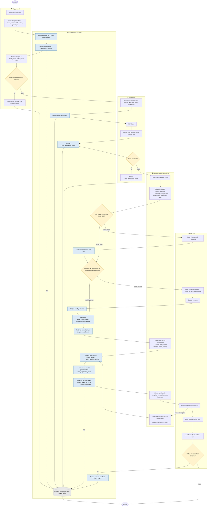

# ERD & Flow Bisnis — SSO Platform

## Sistem Single Sign-On (SSO) dengan Dynamic OAuth2 Client & Dynamic Role Management

| Metadata | Keterangan |
|---|---|
| Terkait | BRD-SSO-Platform.md, PRD-SSO-Platform.md |
| Versi | 1.0 |
| Tanggal | 11 Juli 2026 |

---

## 1. Entity Relationship Diagram (ERD)

Skema data inti SSO Platform, terbagi ke 5 domain: **Identity** (`users`, `user_identities`), **OAuth2 Client Management** (`applications`, `scopes`, `application_scopes`), **Dynamic RBAC** (`application_roles`, `permissions`, `role_permissions`, `user_application_roles`), **OAuth2 Runtime** (`oauth_authorization_codes`, `oauth_access_tokens`, `oauth_refresh_tokens`, `oauth_consents`), dan **Reference/Master Data** (`ref_categories`, `ref_items`, `organizations`, `user_organizations`), ditambah **Governance** (`audit_logs`).

```mermaid
erDiagram

    USERS ||--o{ USER_IDENTITIES : "punya"
    USERS ||--o{ USER_APPLICATION_ROLES : "diberi_role"
    USERS ||--o{ OAUTH_CONSENTS : "memberi_consent"
    USERS ||--o{ OAUTH_AUTHORIZATION_CODES : "meminta"
    USERS ||--o{ OAUTH_ACCESS_TOKENS : "memiliki"
    USERS ||--o{ USER_ORGANIZATIONS : "tergabung"
    USERS ||--o{ APPLICATIONS : "owner_dari"
    USERS ||--o{ AUDIT_LOGS : "melakukan"

    APPLICATIONS ||--o{ APPLICATION_SCOPES : "mengizinkan"
    APPLICATIONS ||--o{ APPLICATION_ROLES : "mendefinisikan"
    APPLICATIONS ||--o{ USER_APPLICATION_ROLES : "target"
    APPLICATIONS ||--o{ OAUTH_AUTHORIZATION_CODES : "diminta_untuk"
    APPLICATIONS ||--o{ OAUTH_ACCESS_TOKENS : "diterbitkan_untuk"
    APPLICATIONS ||--o{ OAUTH_CONSENTS : "disetujui_untuk"

    SCOPES ||--o{ APPLICATION_SCOPES : "digunakan_oleh"

    APPLICATION_ROLES ||--o{ USER_APPLICATION_ROLES : "diberikan_sebagai"
    APPLICATION_ROLES ||--o{ ROLE_PERMISSIONS : "memiliki"
    PERMISSIONS ||--o{ ROLE_PERMISSIONS : "melekat_pada"
    APPLICATIONS ||--o{ PERMISSIONS : "mendefinisikan"

    OAUTH_ACCESS_TOKENS ||--o| OAUTH_REFRESH_TOKENS : "berpasangan"

    REF_CATEGORIES ||--o{ REF_ITEMS : "berisi"
    REF_ITEMS ||--o{ REF_ITEMS : "sub_item_dari"

    ORGANIZATIONS ||--o{ ORGANIZATIONS : "sub_unit_dari"
    ORGANIZATIONS ||--o{ USER_ORGANIZATIONS : "menaungi"
    REF_ITEMS ||--o{ USER_ORGANIZATIONS : "sebagai_jabatan"

    USERS {
        uuid id PK
        string username UK
        string email UK
        string password_hash
        string full_name
        string status "active|inactive|locked"
        boolean mfa_enabled
        timestamp created_at
        timestamp updated_at
    }

    USER_IDENTITIES {
        uuid id PK
        uuid user_id FK
        string provider "local|google|microsoft"
        string provider_user_id
        timestamp created_at
    }

    APPLICATIONS {
        uuid id PK
        string client_id UK
        string client_secret_hash
        string name
        string description
        text redirect_uris "json array"
        text allowed_grant_types "json array"
        string logo_url
        uuid owner_user_id FK
        string status "active|inactive"
        timestamp created_at
        timestamp updated_at
    }

    SCOPES {
        uuid id PK
        string code UK "openid|profile|email|erp:read"
        string description
    }

    APPLICATION_SCOPES {
        uuid id PK
        uuid application_id FK
        uuid scope_id FK
    }

    APPLICATION_ROLES {
        uuid id PK
        uuid application_id FK
        string role_key "unique per application"
        string role_name
        string description
        boolean is_default
        timestamp created_at
    }

    PERMISSIONS {
        uuid id PK
        uuid application_id FK
        string permission_key
        string description
    }

    ROLE_PERMISSIONS {
        uuid id PK
        uuid role_id FK
        uuid permission_id FK
    }

    USER_APPLICATION_ROLES {
        uuid id PK
        uuid user_id FK
        uuid application_id FK
        uuid role_id FK
        uuid granted_by FK
        timestamp granted_at
        string status "active|revoked"
    }

    OAUTH_AUTHORIZATION_CODES {
        uuid id PK
        string code UK
        uuid user_id FK
        uuid application_id FK
        string redirect_uri
        string scope
        string code_challenge
        string code_challenge_method
        timestamp expires_at
        boolean used
    }

    OAUTH_ACCESS_TOKENS {
        uuid id PK
        string token_hash UK
        uuid user_id FK
        uuid application_id FK
        string scope
        timestamp expires_at
        timestamp created_at
        boolean revoked
    }

    OAUTH_REFRESH_TOKENS {
        uuid id PK
        string token_hash UK
        uuid access_token_id FK
        timestamp expires_at
        boolean revoked
    }

    OAUTH_CONSENTS {
        uuid id PK
        uuid user_id FK
        uuid application_id FK
        string scope
        timestamp granted_at
        timestamp revoked_at
    }

    AUDIT_LOGS {
        uuid id PK
        uuid actor_user_id FK
        string action
        string entity_type
        string entity_id
        text metadata "json"
        timestamp created_at
    }

    REF_CATEGORIES {
        uuid id PK
        string code UK "JABATAN|STATUS_PEGAWAI|UNIT_KERJA"
        string name
        string description
        timestamp created_at
    }

    REF_ITEMS {
        uuid id PK
        uuid category_id FK
        uuid parent_id FK "self reference, nullable"
        string code
        string name
        text extra_value "json, optional"
        int sort_order
        boolean is_active
    }

    ORGANIZATIONS {
        uuid id PK
        string code UK
        string name
        uuid parent_id FK "self reference, nullable"
        string type "company|division|department"
        boolean is_active
    }

    USER_ORGANIZATIONS {
        uuid id PK
        uuid user_id FK
        uuid organization_id FK
        uuid position_ref_item_id FK "ref ke REF_ITEMS kategori JABATAN"
        boolean is_primary
    }
```

---

## 2. Flow Bisnis

Alur bisnis end-to-end SSO Platform, digambarkan dalam 5 lane: **Super Admin**, **App Owner**, **Aplikasi Eksternal (Client)**, **End User**, dan **SSO Platform (System)**. Mencakup 5 sub-alur yang saling terhubung:

1. **Onboarding Aplikasi Klien** — Super Admin mendaftarkan aplikasi baru secara self-service (generate `client_id`/`client_secret`).
2. **Dynamic Role Management** — App Owner membuat role khusus aplikasinya & assign ke user, tanpa melibatkan tim SSO.
3. **Login OAuth2 (Authorization Code + PKCE)** — alur inti otentikasi lintas aplikasi.
4. **Refresh Token** — perpanjangan sesi tanpa login ulang.
5. **Consent Management** — user meninjau & mencabut izin akses aplikasi kapan saja.

Seluruh aksi tercatat ke `audit_logs` (garis putus-putus pada diagram).

